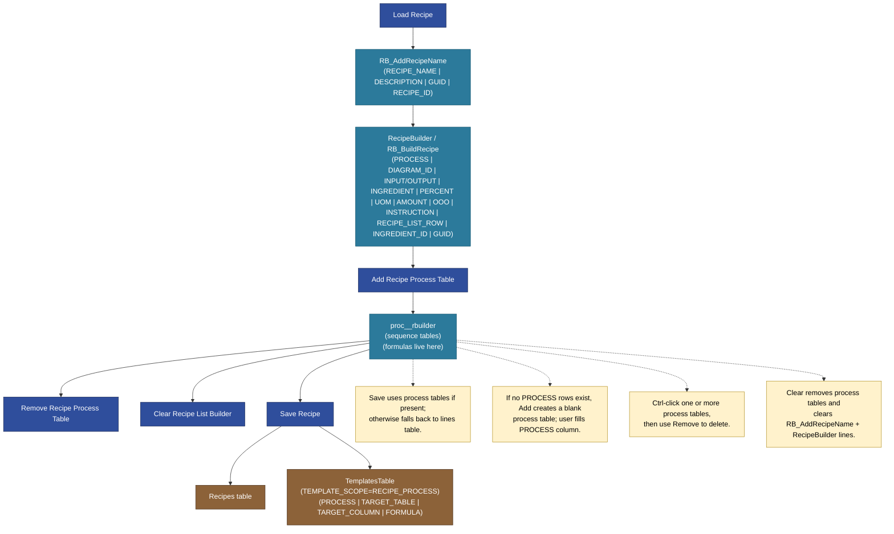
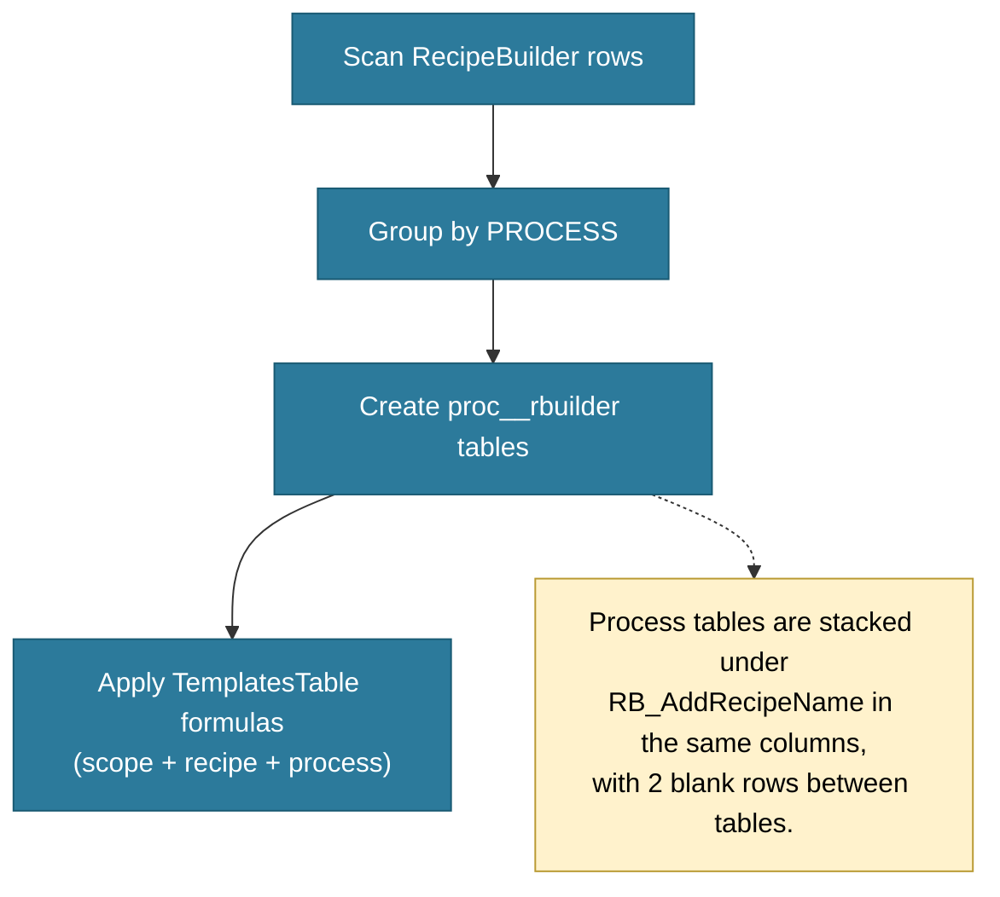

# Recipe List Builder (Production)

This doc captures the current Recipe List Builder flow in the Production sheet and how process tables + templates are saved.

## What exists now
- Header table: `RB_AddRecipeName` (RECIPE_NAME, DESCRIPTION, GUID, RECIPE_ID)
- Lines table: `RecipeBuilder` / `RB_BuildRecipe` (PROCESS, DIAGRAM_ID, INPUT/OUTPUT, INGREDIENT, PERCENT, UOM, AMOUNT, OOO, INSTRUCTION, RECIPE_LIST_ROW, INGREDIENT_ID, GUID)
- Process tables: `proc_<n>_rbuilder` (sequence number, autogenerated)
- Templates: `TemplatesTable` (scope = `RECIPE_PROCESS`, process + column formulas)

## Builder flow (save/load + templates)

## Process table build (per PROCESS)

## Notes / conventions
- Process tables are named `proc_<n>_rbuilder` (sequence number, auto-generated).
- Users enter the process name in the PROCESS column after the table is created.
- Process table headers: PROCESS, DIAGRAM_ID, INPUT/OUTPUT, INGREDIENT, PERCENT, UOM, AMOUNT, OOO, INSTRUCTION, RECIPE_LIST_ROW, INGREDIENT_ID, GUID.
- The PROCESS column in each process table stores the original process name (used for template filtering).
- `Save Recipe` deletes existing rows for the RECIPE_ID, then writes concatenated rows from all process tables.
- Template rows are replaced per RECIPE_ID + TEMPLATE_SCOPE when saving.
- Template scope constant: `RECIPE_PROCESS`.
- RB_AddRecipeName is always present on the sheet (header table).
- Add/Remove buttons manage the process tables (build from lines, delete selected tables).
- Clear Recipe List Builder removes process tables and clears RB_AddRecipeName + RecipeBuilder lines.
- Process tables are anchored under RB_AddRecipeName with 2 blank rows between tables.
- Banding/row-shift logic will be needed so process tables can expand/contract without colliding with other systems.
