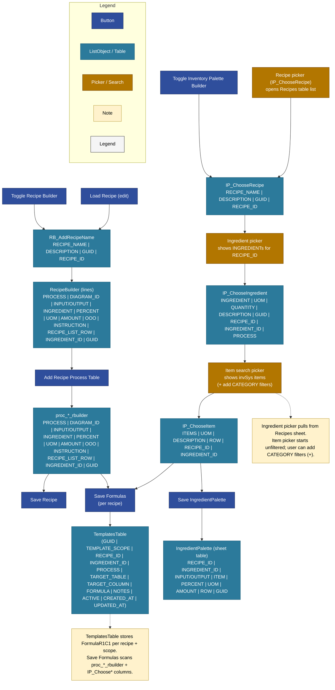
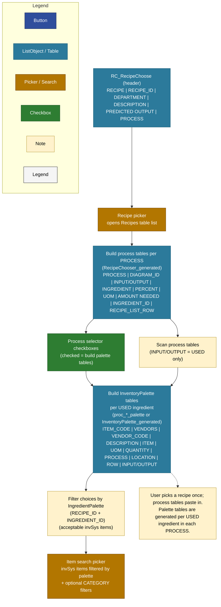
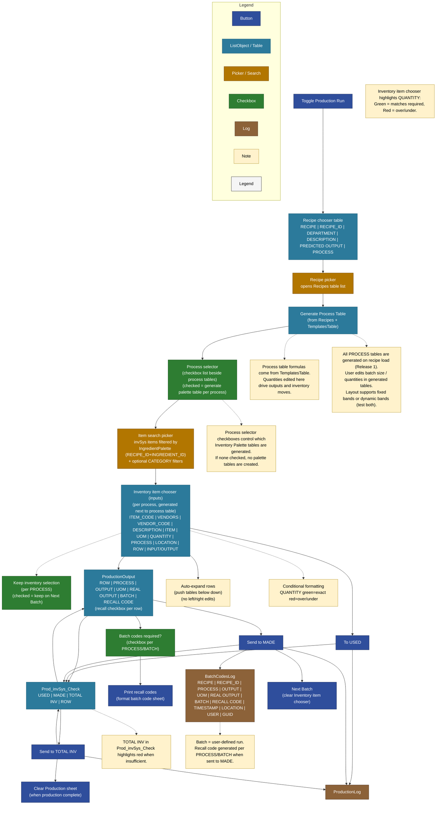
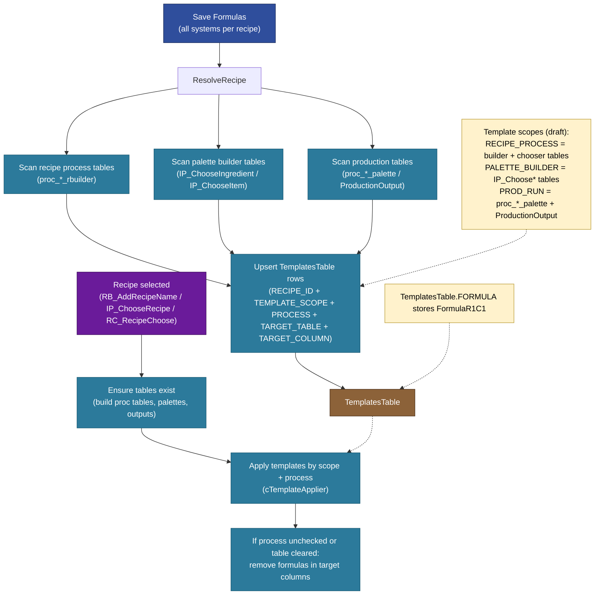

# Production System - User Workflow Diagrams (Draft)

## 1) Recipe Builder + Inventory Palette Builder (user-facing)

## 3) Recipe Chooser (System 3: user-facing)

## 2) Production Run (Recipe chooser → outputs → logs)

## 4) Formula Management (VBA-level draft)

