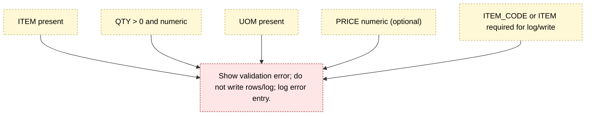

Validation & Error Rules — Mermaid
==================================

Checklist (confirm-time)
------------------------
- Required: ITEM (or ITEM_CODE), UOM, QTY.
- Types/ranges: QTY numeric > 0; PRICE numeric if present.
- Business lookups (optional but recommended): ITEM_CODE/ITEM in catalog; UOM in allowed list.
- Schema guard: required columns exist in ReceivedTally and Aggregated list; fail hard if missing.

Behavior on success
-------------------
- Write all aggregated rows to invSys.RECEIVED.
- Write audit to ReceivedLog (who, when, rows count/keys, optional snapshot ID).
- Atomic: all-or-nothing for rows/log (no partial writes).

Behavior on failure
-------------------
- No writes to invSys.RECEIVED or ReceivedLog.
- User sees concise, actionable error message.
- Optional: log a validation error entry (row/context, message, user, timestamp) in ReceivedLog as type=Error.

Surface & UX
------------
- Validation runs on Confirm. Aggregated list remains unchanged if validation fails.
- Per-insert validation (Item Search add) should be light: disallow blank item/zero qty; full validation stays at Confirm.

Error code/message sketch
-------------------------
| Code  | Condition                           | Message (suggested)                             |
|-------|-------------------------------------|-------------------------------------------------|
| V-ITEM| ITEM/ITEM_CODE missing              | "Select an item before confirming."             |
| V-UOM | UOM missing                         | "UOM is required for all rows."                 |
| V-QTY | QTY not numeric or <= 0             | "Quantity must be a number greater than 0."     |
| V-CAT | Item/UOM not in catalog (optional)  | "Item/UOM not recognized; check catalog."       |
| V-COLS| Required columns missing (schema)   | "Receiving table is missing required columns."  |

Notes
-----
- Undo/Redo: if validation fails, nothing is written; macro undo/redo isn’t touched. If confirm succeeds, a single undo should revert rows + log entry.
- Keep messages short and specific; include row context if you log errors.
