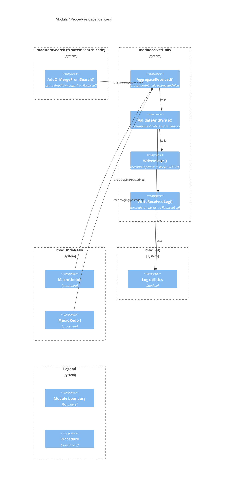

Module/Procedure Dependency — Mermaid (C4 style)
================================================

```mermaid
C4Component
title Module / Procedure dependencies

Boundary(modItemSearch_b, "modItemSearch (frmItemSearch code)") {
  Component(P1, "AddOrMergeFromSearch()", "procedure\nadds/merges into ReceivedTally")
}

Boundary(modReceivedTally_b, "modReceivedTally") {
  Component(P2, "AggregateReceived()", "procedure\nbuilds aggregated view")
  Component(P3, "ValidateAndWrite()", "procedure\nvalidate + write rows/log")
  Component(P4, "WriteInvSys()", "procedure\npersist to invSys.RECEIVED")
  Component(P5, "WriteReceivedLog()", "procedure\npersist to ReceivedLog")
}

Boundary(modUndoRedo_b, "modUndoRedo") {
  Component(P6, "MacroUndo()", "procedure")
  Component(P7, "MacroRedo()", "procedure")
}

Boundary(modLog_b, "modLog") {
  Component(LOG, "Log utilities", "module")
}

Rel(P1, P2, "triggers aggregate view")
Rel(P2, P3, "calls")
Rel(P3, P4, "calls")
Rel(P3, P5, "calls")
Rel(P4, LOG, "uses")
Rel(P5, LOG, "uses")

Rel(P6, P2, "undo staging/posted/log")
Rel(P7, P2, "redo staging/posted/log")

Boundary(legend, "Legend") {
  Component(LM, "Module boundary", "boundary")
  Component(LP, "Procedure", "component")
}
```
