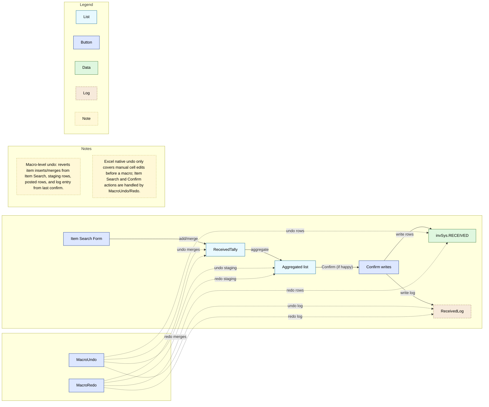

Undo / Redo Policy — Mermaid
============================

```mermaid
flowchart LR
    classDef list fill:#e8f9ff,stroke:#2c7a9b,color:#000,stroke-width:1.2px;
    classDef data fill:#dff7df,stroke:#2f6f2f,color:#000;
    classDef log fill:#f7eadb,stroke:#8c6239,color:#000,stroke-dasharray:4 3;
    classDef button fill:#dde7ff,stroke:#2f4e9c,color:#000,stroke-width:1.2px;
    classDef note fill:#fff8d7,stroke:#b5a542,color:#000,stroke-dasharray:3 3;
    classDef legend fill:#f4f4f4,stroke:#999,color:#000,stroke-dasharray:2 2;

    subgraph Macros [ ]
      direction LR
      REDO["MacroRedo"]:::button
      UNDO["MacroUndo"]:::button
    end

    subgraph Data [ ]
      direction LR
      SRC["Item Search Form"]:::button
      RT["ReceivedTally"]:::list
      AGG["Aggregated list"]:::list
      CNF["Confirm writes"]:::button
      INV["invSys.RECEIVED"]:::data
      RLOG["ReceivedLog"]:::log
    end

    SRC -->|add/merge| RT -->|aggregate| AGG -->|"Confirm (if happy)"| CNF
    CNF -->|write rows| INV
    CNF -->|write log| RLOG

    UNDO -.->|undo merges| RT
    UNDO -.->|undo staging| AGG
    UNDO -.->|undo rows| INV
    UNDO -.->|undo log| RLOG

    REDO -.->|redo merges| RT
    REDO -.->|redo staging| AGG
    REDO -.->|redo rows| INV
    REDO -.->|redo log| RLOG

    %% Notes placed below to reduce edge clutter
    subgraph Notes [Notes]
      direction TB
      NOTE1["Macro-level undo: reverts item inserts/merges from Item Search, staging rows, posted rows, and log entry from last confirm."]:::note
      NOTE2["Excel native undo only covers manual cell edits before a macro; Item Search and Confirm actions are handled by MacroUndo/Redo."]:::note
    end

    %% Legend (separate subgraph to avoid entering main flow)
    subgraph Legend [Legend]
      direction LR
      L1["List"]:::list
      L2["Button"]:::button
      L3["Data"]:::data
      L4["Log"]:::log
      L5["Note"]:::note
    end
```