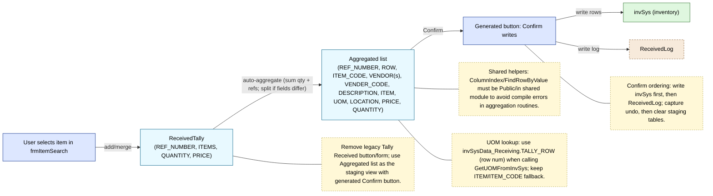

Tally Received fix proposal (Mermaid, updated)
==============================================

Goal: remove the legacy “Tally Received” form/button; use the Aggregated list (auto-built) and a generated Confirm button instead.

