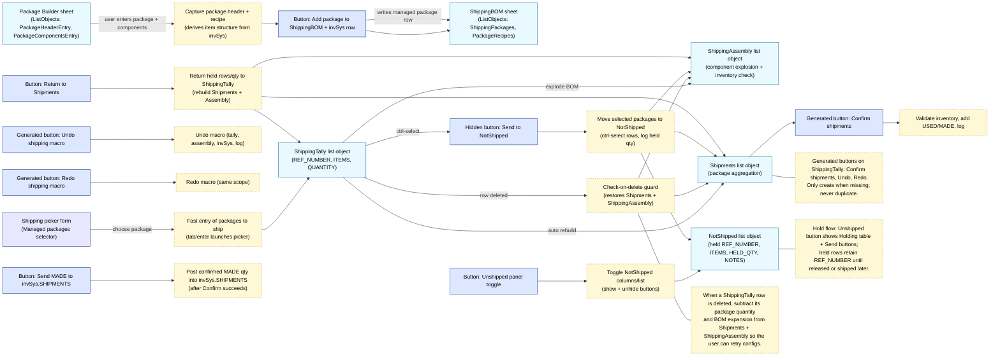

Forms Map / Controls Interaction – Shipping
==========================================

```mermaid
flowchart LR
    classDef form fill:#e7e7ff,stroke:#4d4d8c,color:#000,stroke-width:1.2px;
    classDef genbtn fill:#dde7ff,stroke:#2f4e9c,color:#000,stroke-width:1.2px;
    classDef sheet fill:#e8f9ff,stroke:#2c7a9b,color:#000,stroke-width:1.2px;
    classDef action fill:#fff8d7,stroke:#b5a542,color:#000,stroke-dasharray:3 3;

    BUILDER["Package Builder sheet\n(ListObjects: PackageHeaderEntry, PackageComponentsEntry)"]:::sheet
    BTN_CREATE["Button: Add package to ShippingBOM + invSys row"]:::genbtn
    BOM["ShippingBOM sheet\n(ListObjects: ShippingPackages, PackageRecipes)"]:::sheet

    PICKER["Shipping picker form\n(Managed packages selector)"]:::form
    TALLY["ShippingTally list object\n(REF_NUMBER, ITEMS, QUANTITY)"]:::sheet
    ASSY["ShippingAssembly list object\n(component explosion + inventory check)"]:::sheet
    SHIP["Shipments list object\n(package aggregation)"]:::sheet
    HOLD["NotShipped list object\n(held REF_NUMBER, ITEMS, HELD_QTY, NOTES)"]:::sheet

    BTN_CONFIRM["Generated button: Confirm shipments"]:::genbtn
    BTN_UNDO["Generated button: Undo shipping macro"]:::genbtn
    BTN_REDO["Generated button: Redo shipping macro"]:::genbtn
    BTN_UNSHIP["Button: Unshipped panel toggle"]:::genbtn
    BTN_SEND_HOLD["Hidden button: Send to NotShipped"]:::genbtn
    BTN_RETURN_HOLD["Button: Return to Shipments"]:::genbtn
    BTN_SEND_SHIP["Button: Send MADE to invSys.SHIPMENTS"]:::genbtn

    ACT_BUILD["Capture package header + recipe\n(derives item structure from invSys)"]:::action
    ACT_TALLY["Fast entry of packages to ship\n(tab/enter launches picker)"]:::action
    ACT_CONFIRM["Validate inventory, add USED/MADE, log"]:::action
    ACT_UNDO["Undo macro (tally, assembly, invSys, log)"]:::action
    ACT_REDO["Redo macro (same scope)"]:::action
    ACT_DELETE["Check-on-delete guard\n(restores Shipments + ShippingAssembly)"]:::action
    ACT_SHOW_HOLD["Toggle NotShipped columns/list\n(show + unhide buttons)"]:::action
    ACT_MOVE_HOLD["Move selected packages to NotShipped\n(ctrl-select rows, log held qty)"]:::action
    ACT_RETURN_HOLD["Return held rows/qty to ShippingTally\n(rebuild Shipments + Assembly)"]:::action
    ACT_POST_SHIP["Post confirmed MADE qty into invSys.SHIPMENTS\n(after Confirm succeeds)"]:::action
    NOTE_BTN["Generated buttons on ShippingTally: Confirm shipments, Undo, Redo.\nOnly create when missing; never duplicate."]:::action
    NOTE_DEL["When a ShippingTally row is deleted, subtract its package quantity\nand BOM expansion from Shipments + ShippingAssembly so the user can retry configs."]:::action
    NOTE_HOLD["Hold flow: Unshipped button shows Holding table + Send buttons;\nheld rows retain REF_NUMBER until released or shipped later."]:::action

    BUILDER -->|user enters package + components| ACT_BUILD --> BTN_CREATE --> BOM
    BTN_CREATE -->|writes managed package row| BOM

    PICKER -->|choose package| ACT_TALLY --> TALLY
    TALLY -->|auto rebuild| SHIP
    TALLY -->|explode BOM| ASSY
    TALLY -->|"row deleted"| ACT_DELETE --> SHIP
    ACT_DELETE --> ASSY
    BTN_UNSHIP --> ACT_SHOW_HOLD --> HOLD
    TALLY -->|"ctrl-select"| BTN_SEND_HOLD --> ACT_MOVE_HOLD --> HOLD
    ACT_MOVE_HOLD --> ASSY
    ACT_MOVE_HOLD --> SHIP
    BTN_RETURN_HOLD --> ACT_RETURN_HOLD --> TALLY
    ACT_RETURN_HOLD --> ASSY
    ACT_RETURN_HOLD --> SHIP
    SHIP --> BTN_CONFIRM
    BTN_CONFIRM --> ACT_CONFIRM
    BTN_UNDO --> ACT_UNDO
    BTN_REDO --> ACT_REDO
    BTN_SEND_SHIP --> ACT_POST_SHIP

    SHIP --- NOTE_BTN
    ACT_DELETE --- NOTE_DEL
    HOLD --- NOTE_HOLD
```
