ShippingTally System – VBA Interaction Map
==========================================

The diagram shows how each button or worksheet event connects to VBA procedures, which tables they touch, and where they log. Module names are placeholders until code is written (e.g., `modTS_Shipping`, `modTS_BoxBuilder`, `modInventoryLog`).

```mermaid
flowchart LR
    classDef button fill:#ffda79,stroke:#d97706,color:#111,font-weight:bold;
    classDef proc fill:#c7f9cc,stroke:#15803d,color:#0f172a;
    classDef table fill:#a5d8ff,stroke:#1d4ed8,color:#0f172a;
    classDef log fill:#ffd6e0,stroke:#be185d,color:#111;
    classDef warn fill:#ffe8cc,stroke:#b45309,color:#111;

    subgraph Builder["Box Builder block (ShipmentsTally sheet)"]
        BTN_SHOW["BTN_SHOW_BUILDER / BTN_HIDE_BUILDER"]:::button
        PROC_SHOW["ShowHideBuilderColumns()\n(modTS_BoxBuilder)"]:::proc
        BTN_SAVE["BTN_SAVE_BOX"]:::button
        PROC_SAVE["SaveBoxDefinition()\n - validate headers (≤50 rows)\n - lookup invSys row\n - create/update ListObject named after Box\n - write ROW/QUANTITY/UOM only\n - add/refresh invSys row"]:::proc
        BuilderTables["Box Name / BoxBOM tables"]:::table
        BTN_SHOW --> PROC_SHOW --> BuilderTables
        BuilderTables --> BTN_SAVE
        BTN_SAVE --> PROC_SAVE
        PROC_SAVE --> ShippingBOM["ShippingBOM (ShippingPackages + PackageRecipes)"]:::table
        PROC_SAVE --> invSys["invSys table (ROW generated)"]:::table
        PROC_SAVE --> InventoryLog["InventoryLog"]:::log
        invSys -.->|ROW/UOM change detected| PROC_SYNC["SyncBomMetadata()\n - locate affected BOM blocks\n - automatically update UOM/ROW references"]:::proc
        PROC_SYNC --> ShippingBOM
    end

    subgraph Runtime["ShipmentsTally runtime block"]
        STALLY["ShipmentsTally"]:::table
        NOTSHIP["NotShipped"]:::table
        AGGBOM["AggregateBoxBOM"]:::table
        AGGPACK["AggregatePackages"]:::table
        CHECKINV["Check_invSys"]:::table
        INSTRUCT["BOM Instructions column"]:::table
        CHK_EXIST["CHK_USE_EXISTING?"]:::button

        STALLY -.->|WorksheetChange| PROC_TALLY["RebuildAggregates()\n(modTS_Shipping)"]:::proc
        PROC_TALLY --> AGGBOM
        PROC_TALLY --> AGGPACK
        PROC_TALLY --> CHECKINV
        PROC_TALLY --> InstructProc["UpdateInstructions()\n(copy BOM text)"]:::proc
        InstructProc --> INSTRUCT
        CHK_EXIST --> PROC_EXIST["UseExistingInventoryFirst()\n - compare Shipments demand vs invSys.TOTAL_INV\n - reduce BOM requirement before builds"]:::proc
        PROC_EXIST --> CHECKINV

        BTN_UNSHIP["BTN_UNSHIP"]:::button
        BTN_SENDHOLD["BTN_SEND_HOLD"]:::button
        BTN_RETURN["BTN_RETURN_HOLD"]:::button
        PROC_HOLD_TOGGLE["ToggleHoldPane()\n(show/hide NotShipped)"]:::proc
        PROC_SEND_HOLD["SendSelectedToHold()\n - ctrl-select rows\n - move to NotShipped\n - prompt for held qty entry"]:::proc
        PROC_RETURN_HOLD["ReturnHoldToTally()\n - push rows back\n - clear NotShipped rows"]:::proc

        BTN_UNSHIP --> PROC_HOLD_TOGGLE --> NOTSHIP
        STALLY -->|selection| BTN_SENDHOLD --> PROC_SEND_HOLD --> NOTSHIP
        NOTSHIP --> BTN_RETURN --> PROC_RETURN_HOLD --> STALLY
        PROC_SEND_HOLD --> AGGBOM
        PROC_SEND_HOLD --> AGGPACK
        PROC_RETURN_HOLD --> AGGBOM
        PROC_RETURN_HOLD --> AGGPACK

        PROC_TALLY --> LogST["ShipmentsTally_Log"]:::log
        PROC_SEND_HOLD --> LogNS["NotShipped_Log"]:::log
        PROC_TALLY --> LogBOM["AggregateBoxBOM_Log"]:::log
        PROC_TALLY --> LogPack["AggregatePackages_Log"]:::log
        PROC_TALLY --> LogCheck["Check_invSys_Log"]:::log
    end

    subgraph Confirm["Confirm + inventory writes"]
        BTN_CON["BTN_CONFIRM_INV"]:::button
        PROC_CONFIRM["ConfirmInventory()\n - validate references\n - ensure held qty stays on NotShipped\n - capture snapshots/logs (no inv writes)"]:::proc
        BTN_BOXES["BTN_BOXES_MADE"]:::button
        PROC_BOXES["BuildPackagesFromBOM()\n 1) add needed qty to invSys.USED\n 2) deduct same qty from invSys.TOTAL_INV\n 3) add finished packages to invSys.MADE"]:::proc
        BTN_TOTAL["BTN_TO_TOTALINV"]:::button
        PROC_TOTAL["PushMadeToTotalInv()\n - reduce invSys.MADE\n - add qty to invSys.TOTAL_INV (finished stock)"]:::proc
        BTN_TO_SHIP["BTN_TO_SHIPMENTS"]:::button
        PROC_TO_SHIP["UseExistingFirstThenShip()\n - consume invSys.TOTAL_INV finished goods first\n - if short, pull from invSys.MADE\n - add ShipmentsTally qty to invSys.SHIPMENTS"]:::proc
        BTN_SHIP["BTN_SHIPMENTS_SENT"]:::button
        PROC_SHIP["FinalizeShipments()\n - log instructions\n - deduct invSys.SHIPMENTS from TOTAL_INV\n - clear instructions"]:::proc

        BTN_CON --> PROC_CONFIRM
        CHK_EXIST --> PROC_EXIST -.-> BTN_BOXES
        BTN_BOXES --> PROC_BOXES
        PROC_BOXES --> invUsed["invSys.USED"]:::table
        PROC_BOXES --> invTotal["invSys.TOTAL INV"]:::table
        PROC_BOXES --> invMade["invSys.MADE"]:::table
        PROC_BOXES --> InventoryLog:::log

        BTN_TOTAL --> PROC_TOTAL --> invTotal
        PROC_TOTAL --> invMade
        PROC_TOTAL -->|clear tables| Runtime
        PROC_TOTAL --> InventoryLog

        BTN_TO_SHIP --> PROC_TO_SHIP
        PROC_TO_SHIP --> invTotal
        PROC_TO_SHIP --> invMade
        PROC_TO_SHIP --> invShip["invSys.SHIPMENTS"]:::table
        PROC_TO_SHIP --> InventoryLog

        BTN_SHIP --> PROC_SHIP
        PROC_SHIP --> invShip
        PROC_SHIP --> invTotal
        PROC_SHIP --> InventoryLog
    end

    ShippingBOM -->|picker source| STALLY
    invSys -->|ROW resolves in picker| STALLY
    invMade --> BTN_SHIP
    NOTSHIP -.->|held qty reduces available packages| BTN_CON:::warn

    %% Legend
    subgraph Legend["Legend (high contrast)"]
        direction LR
        LBTN["Button / UI trigger"]:::button
        LPROC["VBA procedure"]:::proc
        LTABLE["Worksheet table/list"]:::table
        LLOG["Logging table"]:::log
        LWARN["Constraint / warning flow"]:::warn
    end
    style Legend fill:#0f172a,stroke:#fef08a,color:#f8fafc
```

