ShippingTally System – User Workflow (v3)
=========================================

- All subsystems (Box Builder, ShipmentsTally, NotShipped, Aggregates, Check_invSys, instruction column) live on the **ShipmentsTally** sheet; ShippingBOM stores the persistent package definitions. Each saved BOM occupies a fixed 52-row block (50 data rows + header spacing) within ShippingBOM. `BTN_SAVE_BOX` creates/updates a ListObject whose name matches the Box Name, storing only `ROW`, `QUANTITY`, and `UOM` for up to 50 components; descriptive fields are always resolved live from `invSys`. Whenever invSys UOM/ROW changes, the builder automatically cascades the new values across any BOM blocks that reference the affected ROW so consistency is enforced.
- UOM drift guard: any time `invSys` UOM/ROW metadata changes for a component that exists in saved BOMs, the system auto-updates those BOM rows (with an informational notification) to keep the BOMs in lock-step with invSys. No divergence is allowed.
- Buttons now include: `BTN_SHOW_BUILDER`/`BTN_HIDE_BUILDER` (toggle builder block), `BTN_SAVE_BOX`, `BTN_UNSHIP`, `BTN_SEND_HOLD`, `BTN_RETURN_HOLD`, `BTN_CONFIRM_INV`, `BTN_BOXES_MADE`, `BTN_TO_TOTALINV`, `BTN_TO_SHIPMENTS`, `BTN_SHIPMENTS_SENT`.
- `Check_invSys` displays (USED, MADE, SHIPMENTS, TOTAL_INV, ROW) for only those ROWs currently in AggregateBoxBOM or AggregatePackages; it prevents shipping held items until they return to ShipmentsTally.
- A checkbox `CHK_USE_EXISTING?` allows operators to consume pre-built packages (invSys.TOTAL_INV) before triggering BOM builds; when checked and inventory is sufficient, BTN_BOXES_MADE is skipped or only covers the shortfall.
- BOM instructions (copied from the active Box BOM) are pasted into a staging column just to the right of `Check_invSys`; they are removed automatically when `BTN_SHIPMENTS_SENT` records the shipment and deducts inventory from `invSys.TOTAL_INV`.
- invSys is the single source of truth: whenever any macro changes `USED`, `MADE`, `SHIPMENTS`, or `TOTAL_INV`, the delta is written to `InventoryLog` (LOG_ID, USER, ACTION, ROW, ITEM_CODE, ITEM_NAME, QUANTITY_CHANGE, NEW_QUANTITY, TIMESTAMP).

```mermaid
flowchart LR
    classDef button fill:#dde7ff,stroke:#2f4e9c,color:#000,font-weight:bold;
    classDef list fill:#e8f9ff,stroke:#2c7a9b,color:#000;
    classDef sys fill:#f0f9ff,stroke:#0f5b78,color:#000;
    classDef log fill:#fef6e4,stroke:#b9730f,color:#000;
    classDef action fill:#fff2cc,stroke:#b99a33,color:#000;
    classDef instr fill:#fff0f6,stroke:#b83280,color:#000;

    subgraph BuilderBlock["ShipmentsTally sheet – Box Builder"]
        BTNSHOW["BTN_SHOW_BUILDER / BTN_HIDE_BUILDER"]:::button
        BBENTRY["Box Name / BoxBOM tables"]:::list
        BTNSAVE["BTN_SAVE_BOX"]:::button
        BBSTEP["Fill invSys fields + pick BOM parts\n(enforce <=50 rows, ROW+QTY+UOM only)"]:::action
        BTNSHOW -->|toggle columns| BBENTRY
        BBENTRY --> BBSTEP --> BTNSAVE
        BTNSAVE -->|create/update ListObject named after Box\nstore ROW/QUANTITY/UOM| ShippingBOM["ShippingBOM sheet\n52-row blocks per BOM"]:::list
        BTNSAVE -->|create/refresh item\nassign invSys ROW| invRow["invSys managed row"]:::sys
        BTNSAVE -->|UOM/ROW watchdog\nauto-sync BOM metadata when invSys changes| BuilderAlert["BOM consistency auto-sync"]:::instr
    end

    subgraph RuntimeBlock["ShipmentsTally sheet – runtime tables"]
        STALLY["ShipmentsTally\n(REF_NUMBER, ITEMS, QUANTITY)"]:::list
        NOTSHIP["NotShipped\n(held REF/ITEM/QTY)"]:::list
        AGGBOM["AggregateBoxBOM\n(ROW, ITEM, NEEDED_QTY)"]:::list
        AGGPACK["AggregatePackages\n(ROW, ITEM, QTY)"]:::list
        CHECKSYS["Check_invSys\n(USED, MADE, SHIPMENTS, TOTAL_INV, ROW)"]:::list
        INSTRUCT["BOM Instructions column\n(next to Check_invSys)"]:::instr
        CHK_EXIST["CHK_USE_EXISTING?"]:::button
        BTNUNSHIP["BTN_UNSHIP\n(show NotShipped)"]:::button
        BTNSENDHOLD["BTN_SEND_HOLD\n(ctrl-select rows → NotShipped)"]:::button
        BTNRETURN["BTN_RETURN_HOLD\n(return held rows)"]:::button

        STALLY -->|auto tally| AGGBOM
        STALLY -->|auto tally| AGGPACK
        AGGBOM -->|filter rows| CHECKSYS
        AGGPACK -->|filter rows| CHECKSYS
        BTNUNSHIP -->|toggle columns| NOTSHIP
        STALLY -->|ctrl-select| BTNSENDHOLD -->|move | NOTSHIP
        NOTSHIP -->|release| BTNRETURN --> STALLY
        NOTSHIP -.->|cannot ship until returned| AGGPACK
        CHK_EXIST -->|if checked| CHECKSYS
    end

    subgraph ConfirmStage["Confirm + build / ship packages"]
        BTNCONFINV["BTN_CONFIRM_INV"]:::button
        CONF_ACT["Validate references\n(no held rows shipping) & snapshot logs"]:::action
        BTNCONFINV --> CONF_ACT

        BTNBOXMADE["BTN_BOXES_MADE"]:::button
        BOXMADE_ACT["Use Shipping BOMs (only for shortfall) →\n1) add needed qty to invSys.USED\n2) deduct same qty from invSys.TOTAL_INV\n3) add finished packages to invSys.MADE"]:::action
        CHK_EXIST -->|if unchecked or insufficient stock| BTNBOXMADE
        BTNBOXMADE --> BOXMADE_ACT
        BOXMADE_ACT --> invUsed["invSys.USED"]:::sys
        BOXMADE_ACT --> invTotalDown["invSys.TOTAL_INV (consumed)"]:::sys
        BOXMADE_ACT --> invMade["invSys.MADE"]:::sys
        BOXMADE_ACT -->|log change| InventoryLog2["InventoryLog"]:::log

        BTN_TO_TOTAL["BTN_TO_TOTALINV"]:::button
        TO_TOTAL_ACT["Move finished boxes into inventory only →\nreduce invSys.MADE, add qty to invSys.TOTAL_INV\nclear ShipmentsTally/NotShipped/aggregates to avoid double counting"]:::action
        BTN_TO_TOTAL --> TO_TOTAL_ACT --> invTotal["invSys.TOTAL_INV (finished)"]:::sys
        TO_TOTAL_ACT --> invMade
        TO_TOTAL_ACT -->|log change| InventoryLog3["InventoryLog"]:::log

        BTN_TO_SHIP["BTN_TO_SHIPMENTS"]:::button
        TO_SHIP_ACT["Prepare shipment →\nuse existing finished goods first (invSys.TOTAL_INV)\nif needed, pull remaining from invSys.MADE\nadd ShipmentsTally.QUANTITY to invSys.SHIPMENTS"]:::action
        BTN_TO_SHIP --> TO_SHIP_ACT
        TO_SHIP_ACT --> invTotal
        TO_SHIP_ACT --> invMade
        TO_SHIP_ACT --> invShipPrep["invSys.SHIPMENTS"]:::sys
        TO_SHIP_ACT -->|log change| InventoryLog4["InventoryLog"]:::log

        BTN_SHIP_SENT["BTN_SHIPMENTS_SENT"]:::button
        SHIP_ACT["Log shipment + instructions\nDeduct invSys.SHIPMENTS from invSys.TOTAL_INV\nClear instructions column"]:::action
        BTN_SHIP_SENT --> SHIP_ACT --> invShip["invSys.SHIPMENTS"]:::sys
        SHIP_ACT --> invTotalFinal["invSys.TOTAL_INV (decrement)"]:::sys
        SHIP_ACT -->|log change| InventoryLog5["InventoryLog"]:::log
        SHIP_ACT -->|clear| INSTRUCT
    end

    %% logging tables
    STALLY -->|snapshot| LogST["ShipmentsTally_Log"]:::log
    NOTSHIP -->|snapshot| LogNS["NotShipped_Log"]:::log
    AGGBOM -->|snapshot| LogBOM["AggregateBoxBOM_Log"]:::log
    AGGPACK -->|snapshot| LogPack["AggregatePackages_Log"]:::log
    CHECKSYS -->|snapshot| LogCheck["Check_invSys_Log"]:::log

    ShippingBOM -->|picker source| STALLY
    invRow -->|Package picker resolves ROW| STALLY
    AGGPACK --> BTNCONFINV
    NOTSHIP --> BTNCONFINV
    invUsed --> BTNBOXMADE
    invMade --> BTN_SHIP_SENT

    %% legend
    subgraph Legend
        direction LR
        LBTN["Button"]:::button
        LLIST["List object / table"]:::list
        LLOG["Log table"]:::log
        LACT["Process step"]:::action
        LSYS["invSys table/field"]:::sys
        LINS["Instructions column"]:::instr
    end
```

