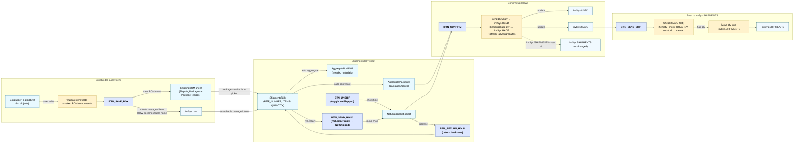

ShippingTally System – User Workflow
====================================

```mermaid
flowchart LR
    classDef button fill:#dde7ff,stroke:#2f4e9c,color:#000,font-weight:bold;
    classDef list fill:#e8f9ff,stroke:#2c7a9b,color:#000;
    classDef action fill:#fff2cc,stroke:#b99a33,color:#000;
    classDef sys fill:#f0f9ff,stroke:#0f5b78,color:#000;

    subgraph BoxBuilder["Box Builder subsystem"]
        BBENTRY["BoxBuilder & BoxBOM\n(list objects)"]:::list
        BTNSAVE["BTN_SAVE_BOX"]:::button
        BBACT["Validate item fields\n+ select BOM components"]:::action
        BBENTRY -->|user edits| BBACT --> BTNSAVE
        BTNSAVE -->|save BOM rows| ShippingBOM["ShippingBOM sheet\n(ShippingPackages + PackageRecipes)"]:::list
        BTNSAVE -->|create managed item\nROW becomes table name| invSysRow["invSys row"]:::sys
    end

    subgraph TallyStage["ShipmentsTally sheet"]
        STALLY["ShipmentsTally\n(REF_NUMBER, ITEMS, QUANTITY)"]:::list
        AGGBOM["AggregateBoxBOM\n(needed materials)"]:::list
        AGGPACK["AggregatePackages\n(packages/boxes)"]:::list
        BTNUNSHIP["BTN_UNSHIP\n(toggle NotShipped)"]:::button
        BTNSENDHOLD["BTN_SEND_HOLD\n(ctrl-select rows → NotShipped)"]:::button
        BTNRETURN["BTN_RETURN_HOLD\n(return held rows)"]:::button
        NOTSHIP["NotShipped list object"]:::list

        STALLY -->|auto aggregate| AGGBOM
        STALLY -->|auto aggregate| AGGPACK
        BTNUNSHIP -->|show/hide| NOTSHIP
        STALLY -->|ctrl-select| BTNSENDHOLD -->|move rows| NOTSHIP
        NOTSHIP -->|release| BTNRETURN --> STALLY
    end

    subgraph ConfirmStage["Confirm workflows"]
        BTNCONF["BTN_CONFIRM"]:::button
        CONF_ACT["Send BOM qty → invSys.USED\nSend package qty → invSys.MADE\nRefresh Tally/aggregates"]:::action
        BTNCONF --> CONF_ACT
        CONF_ACT -->|update| invSysUsed["invSys.USED"]:::sys
        CONF_ACT -->|update| invSysMade["invSys.MADE"]:::sys
        CONF_ACT -.->|invSys.SHIPMENTS stays 0| invSysShip0["invSys.SHIPMENTS (unchanged)"]:::sys
    end

    subgraph ShipStage["Post to invSys.SHIPMENTS"]
        BTNPOST["BTN_SEND_SHIP"]:::button
        POSTCHECK["Check MADE first;\nif empty, check TOTAL INV.\nNo stock → cancel."]:::action
        POSTWRITE["Move qty into invSys.SHIPMENTS"]:::action
        BTNPOST --> POSTCHECK -->|has qty| POSTWRITE --> invSysShip["invSys.SHIPMENTS"]:::sys
    end

    ShippingBOM -->|packages available in picker| STALLY
    invSysRow -->|searchable managed item| STALLY
    AGGPACK --> BTNCONF
    NOTSHIP --> BTNCONF
    invSysMade --> BTNPOST
```
