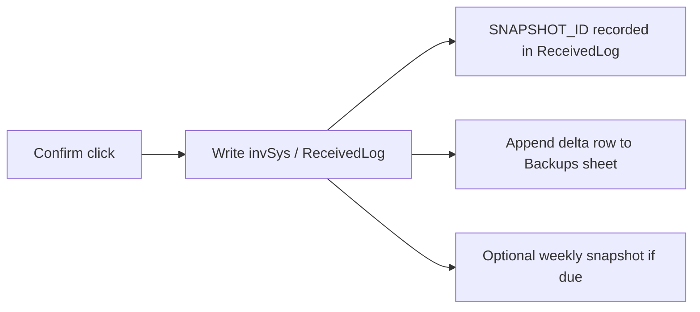

## Data Recovery System — invSys

Goal: survive corruption, accidental deletes, and user mistakes by combining three layers:
1) Append-only companion backup workbook  
2) In-workbook regenerate (structure) + undo/redo (recent VBA writes)  
3) Optional lightweight DB (future)

### Core Policies
- Backups are **append-only**, never edited or deleted.
- Every Confirm writes a `SNAPSHOT_ID` into `ReceivedLog` and an immutable row into the backup file.
- Regenerate is idempotent: on Workbook_Open rebuilds buttons/tables/headers/sheets from manifest.
- Restore is explicit: user chooses snapshot/date; macro overwrites tables, then runs regenerate.

### Companion Backup Workbook (invSys_backup.xlsx)
Sheets:
- `Backups` (append-only deltas)
- `Snapshots_YYYYMMDD` (periodic full copies of `invSys`, `ReceivedLog`, etc.)

Delta row schema (Backups):
```
SNAPSHOT_ID, ENTRY_DATE, USER, ACTION, TABLE_NAME, ROW, ITEM_CODE, ITEM, UOM, LOCATION,
RECEIVED_BEFORE, RECEIVED_AFTER, DELTA, NOTES
```

Snapshot sheets:
- Full table copies with timestamp in sheet name.
- Created weekly or on-demand (“Full snapshot” button).

### Flow — Normal Confirm


### Flow — Restore from Backup


### Flow — Regenerate on Open (structure only)


### Recovery Options
- **Recent mistake:** use in-workbook Undo/Redo (VBA layer) if still in stack.
- **Structural damage:** close/reopen → Regenerate rebuilds shapes/tables/buttons/headers.
- **Data corruption/accidental deletes:** Restore from companion backup snapshot.
- **Deep audit:** Inspect `Backups` sheet (append-only) filtered by SNAPSHOT_ID/ROW/USER.
- **Future-proof:** optionally mirror `Backups` appends into SQLite/Access with same schema.

### Minimal User Actions
- A “Full snapshot” button (weekly or ad-hoc).
- A “Restore from backup” wizard that:
  1) Prompts for backup workbook  
  2) Lists available snapshots/dates/SNAPSHOT_IDs  
  3) Restores selected tables  
  4) Runs Regenerate  

### Integration Points
- ConfirmWrites: generate `SNAPSHOT_ID`, append delta to `Backups`, write to tables, add SNAPSHOT_ID to ReceivedLog.
- Undo/Redo: stays in-memory for last action; does not touch backup files.
- Regenerate: manifest-driven; no user prompts.

### Guardrails
- Never delete rows from `Backups` or snapshot sheets.
- Validate backup file presence on Workbook_Open; warn if missing.
- If backup write fails, block Confirm and alert user.
