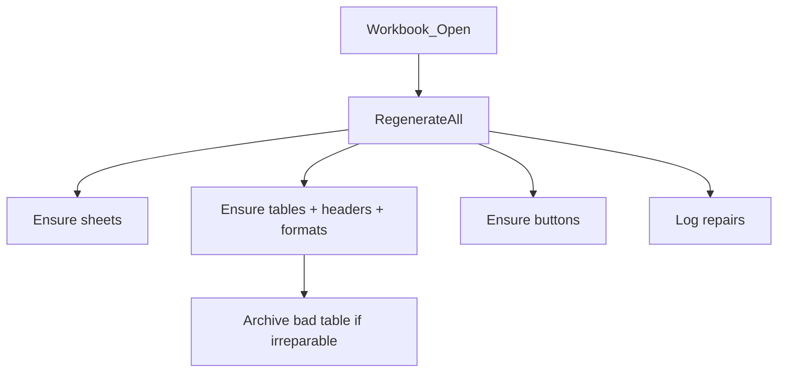
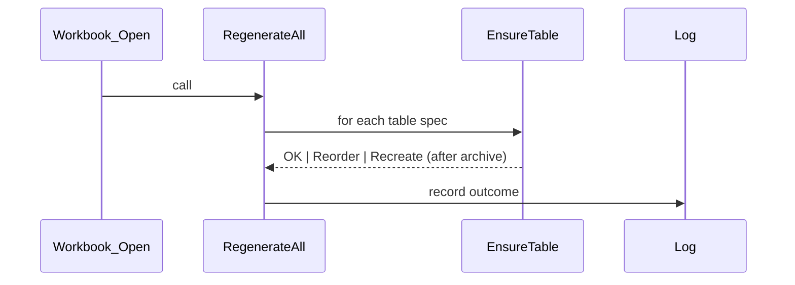
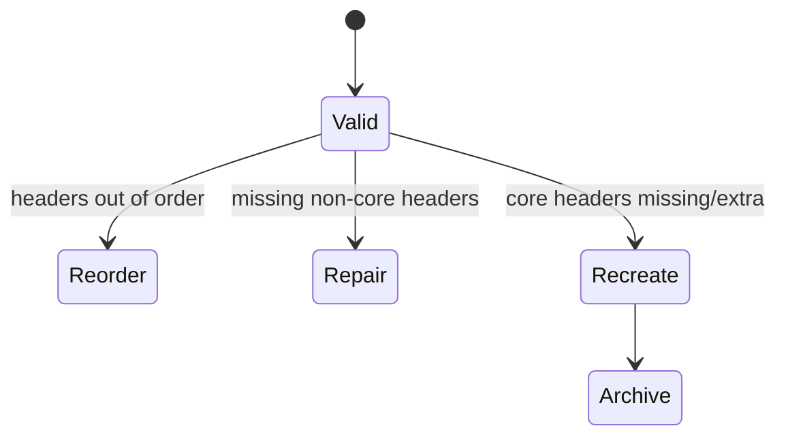

# invSys Regenerate system — proposal

Goal: On workbook open, heal missing/damaged sheets, tables, headers, and system buttons for invSys. Users can “fix by reopen” after accidental deletions.

## Scope
- VBA-driven regeneration only; no external downloads.
- Recreate required sheets if deleted.
- Recreate ListObjects with correct headers/order/number formats.
- Recreate required buttons/controls with correct OnAction.
- Log what was repaired; never duplicate existing valid objects.

## Manifest (static, code-owned)
- For each required sheet: name, tab color (optional), visibility.
- For each sheet: required tables (name, header list, number formats), default location/range.
- For each sheet: required buttons (shape name, caption, OnAction, default position/size).

## Workbook_Open flow (RegenerateAll)
1. For each required sheet:
   - If missing: add sheet, set CodeName/Name if possible, move to expected position.
2. For each sheet’s tables:
   - If missing: create ListObject at default range, write headers, formats.
   - If present:
     - Validate headers against manifest.
     - If reorderable: reorder headers.
     - If repairable (missing headers): add them (warn).
     - If bad (core headers missing/extra): archive old table to `Recovered_<name>_timestamp` sheet, create fresh table.
   - Reapply number formats to key columns (e.g., QUANTITY numeric, ENTRY_DATE date).
3. For each sheet’s buttons:
   - If missing: create FormControl button with name, caption, size/position; set OnAction.
   - If present: reassign OnAction defensively.
4. Log repairs to Immediate Window and optional “RegenerateLog” sheet.

## Edge handling
- Archival: if a table is recreated, copy its existing data to a new sheet before replacing.
- Idempotent: running twice should not duplicate anything.
- Performance: minimal touches when validation passes.

## Mermaid sketches

### Flow – regenerate on open

### Sequence – table repair

### State – validation outcome

## Next steps
- Define manifest in `modSchema`: sheets, tables (headers, formats, default ranges), buttons.
- Implement `modRegenerate` with:
  - `RegenerateAll`
  - `EnsureSheet(spec)`
  - `EnsureTable(spec)`
  - `ValidateTable(lo, headers)`
  - `ArchiveTable(lo)`
  - `EnsureButtons(sheet, specs)`
- Call `RegenerateAll` from `Workbook_Open`.

