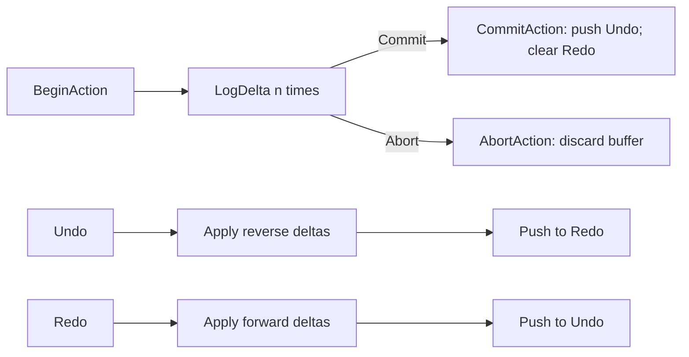
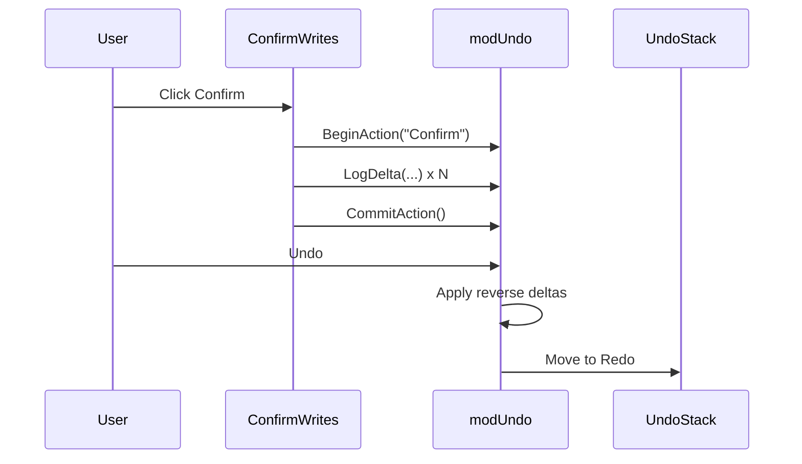
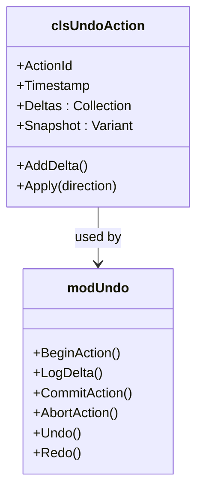
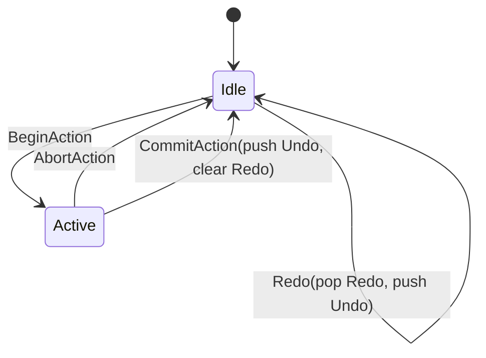

# invSys VBA Undo/Redo – proposal

> Scope: VBA-only, workbook-local, covers value/formula writes plus listobject row add/delete in invSys sheets. Ignores native Excel undo stack and any external/import actions.

## Goals / requirements
- One centralized undo/redo for all VBA writes in invSys.
- Works across modules; actions are pushed when macros run.
- Treat “last user action” as the unit of undo (e.g., a Confirm or a multi-cell fill).
- Redo re-applies exactly what the last undo reversed.
- In-memory only; cleared on close.

## Constraints / assumptions
- We do **not** attempt to restore Excel native undo.
- Only ranges/listobjects in this workbook.
- Structural support limited to:
  - ListObject row add/delete
  - Cell value/formula changes
  - (Optional later) formats/validation
- Large bulk ops may use a per-action snapshot (table-sized), not full workbook.

## Data model
- **ActionStack**
  - UndoStack (LIFO)
  - RedoStack (LIFO)
- **Action (clsUndoAction)**
  - ActionId, Timestamp
  - Deltas (collection)
  - Optional Snapshot (for big ops)
- **Delta**
  - Address or LO row/col (supports row add/delete)
  - BeforeValue / AfterValue
  - OpType: `CellValue`, `RowAdd`, `RowDel`, `TableResize` (optional)

## API (modUndo)
- `BeginAction(label)` – clears temp buffer.
- `LogDelta(addressOrRowInfo, beforeVal, afterVal, opType)`
- `CommitAction()` – push to Undo, clear Redo.
- `AbortAction()` – discard temp buffer.
- `Undo()` – pop Undo, apply reverse deltas, push to Redo.
- `Redo()` – pop Redo, apply forward deltas, push to Undo.
- Helpers:
  - `LogRowAdd(lo, rowIndex, rowValues)`
  - `LogRowDel(lo, rowIndex, rowValues)`
  - `ApplyDelta(delta, direction)`

## Integration points (where to call)
- ConfirmWrites (receiving): wrap the whole confirm in Begin/Commit; log invSys RECEIVED changes and ReceivedLog inserts.
- MergeIntoAggregate / quantity sync: if treated as staging, you can skip logging; if you want undo at staging level, wrap add/merge.
- Any other macro that writes to invSys tables.

## Edge cases
- Table has formulas: store/reapply formulas for cells with formulas (small map).
- Row delete while table filtered: use ListRow.Index on visible rows; restore via stored values.
- Mixed value types: store Variant as-is; preserve numberformat optionally.

## Diagrams

### Flow – action lifecycle

### Sequence – user confirm & undo

### Class sketch

### State (stacks)

## Next steps
- Decide granularity: log only confirmed writes (recommended) vs. every staging edit.
- Implement clsUndoAction (deltas) and modUndo (stacks & API).
- Wire ConfirmWrites to Begin/Log/Commit; wire buttons to Undo/Redo.
- Optional: add row add/delete helpers for listobjects.
