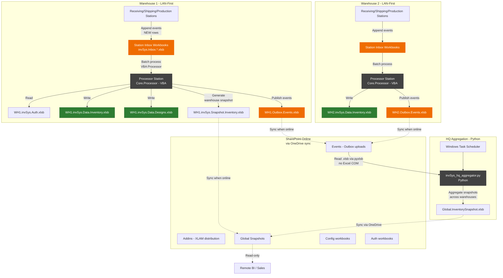
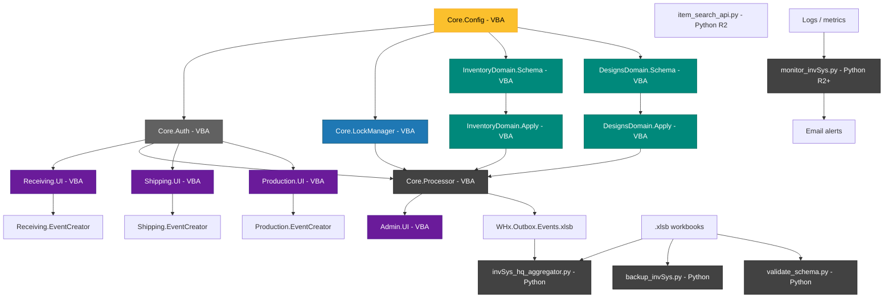
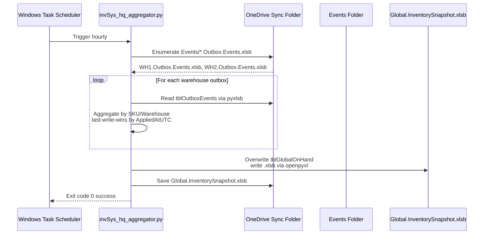
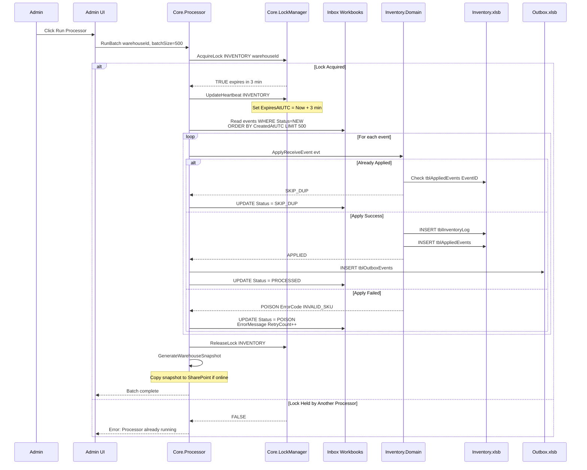

# invSys Architecture v3.1 — Production-Ready Design Specification (REFACTORED)

**Project:** invSys Multi-Warehouse Inventory System  
**Version:** 3.1 (Hybrid VBA + Python Architecture)  
**Date:** February 1, 2026  
**Author:** Justin  
**Purpose:** Complete architectural specification with implementation guidance for AI-assisted development  
**Changes from v3.0:** Added Python components for HQ Aggregator, item search API, and supporting infrastructure

---

## Executive Summary

### Purpose

This document replaces the overlapping/duplicated architecture notes and provides **a single, coherent, Codex AI-ready specification** for the invSys retcon project. The system converts a legacy VBA inventory management application into a modern, event-sourced, multi-warehouse system with **hybrid VBA + Python architecture**.

### Key Architectural Principles

1. **Event Sourcing:** All domain state changes happen via inbox/outbox event streams
2. **Offline-First:** Each warehouse operates autonomously on LAN; SharePoint is a convenience layer
3. **Clear Boundaries:** Core (orchestration) / Domain (writes) / Role (UI) separation
4. **Idempotent Processing:** Crash-safe, restart-safe event application
5. **Hybrid Stack:** VBA for Excel integration, Python for file I/O and infrastructure tasks

### System Capabilities

- Multi-warehouse inventory tracking (receiving, shipping, production)
- Offline-capable operations with eventual consistency
- Role-based access control with capability enforcement
- Event-driven architecture with processor-based batch application
- **Python-powered HQ aggregation** for cross-warehouse visibility
- Self-healing table schemas with automatic migration

### Technology Stack

**Core System (VBA):**
- **Platform:** Microsoft Excel 2016+ (Windows)
- **Language:** VBA (Visual Basic for Applications)
- **Persistence:** Excel workbooks (.xlsb, .xlsm, .xlam)
- **Distribution:** SharePoint Online document library
- **Scheduling:** Windows Task Scheduler
- **Version Control:** Git (via source export)

**Infrastructure Layer (Python):**
- **Platform:** Python 3.11+ (Windows/HQ server)
- **Libraries:** pandas, pyxlsb, openpyxl, pyyaml, flask (Phase 2)
- **Use Cases:** HQ aggregation, backup/restore, schema validation, monitoring, item search API (Phase 2)
- **Rationale:** Avoids VBA file locking issues, 5-10x faster I/O, robust error handling

---

## Architecture Decisions

### D1 — One Write Model Everywhere: Inbox/Outbox + Processor

**Decision:** All domain state changes happen by **appending events** into an **inbox** (and/or publishing **outbox** events). A **processor** is the only component that applies events to authoritative data stores.

**Rationale:**
- Enforces single-writer pattern (processor only)
- Enables offline operation (append-only inboxes don't block)
- Provides audit trail and idempotency
- Crash-safe: unapplied events remain in inbox

**VBA Implementation Details:**

```
RULE: Each station writes to its OWN inbox file 
(e.g., invSys.Inbox.Receiving.S1.xlsb). 

Processor reads ALL station inboxes sequentially in a single 
warehouse run. This avoids VBA file-locking conflicts when 
multiple stations append simultaneously.
```

**SharePoint Sync Strategy:**

```
RULE: Outbox files are written atomically to local disk, 
then copied to SharePoint when sync client is online.

HQ Aggregator copies outbox files to local temp folder 
before reading to avoid corruption from incomplete syncs.
```

---

### D2 — Multi-Warehouse, LAN-First, SharePoint as Convenience Layer

**Decision:** Each warehouse has **local authoritative Excel workbooks** (inventory and optionally designs) and can operate when internet is down. Warehouses **publish outbox workbooks** (and periodic snapshot workbooks) to a **SharePoint team document library** when online. HQ aggregates events and produces a **global snapshot workbook** for cross-warehouse visibility.

**Conflict Resolution:**

```
RULE: Global snapshot aggregation is last-write-wins by AppliedAtUTC. 
Conflicts are logged but not blocked. 

Each warehouse's authoritative store remains independent; 
global snapshot is advisory only for cross-warehouse visibility.

Example: If WH1 and WH2 both receive SKU-123 at 10:05 AM, 
HQ snapshot shows both transactions with their respective 
AppliedAtUTC timestamps. No merge/reconciliation is performed.
```

**Consistency Model:**

- **Warehouse-local:** Strongly consistent (single processor per warehouse)
- **Cross-warehouse:** Eventually consistent (via periodic sync)
- **Global snapshot:** Point-in-time consistent (rebuilt from outbox events)

---

### D3 — Clear Ownership Boundaries

**Decision:**
- **Core:** Authorization gate, orchestration, config, lock manager, processor runner, shared utilities
- **Domain XLAMs:** All writes to authoritative data stores + domain invariants
- **Role XLAMs:** UI + event creation only
- **Admin XLAM:** Orchestration console only (invokes Core + domain routines; does not write domain tables directly)

**Clarification on Domain Reads:**

```
RULE: Domain XLAMs expose READ-ONLY query functions 
(e.g., GetOnHandQty, GetBOM, ListDesigns). 

Admin XLAM and Role XLAMs may call these for UI display.
WRITE operations go through Core.Orchestrate only.

Example:
- ✅ Admin calls InventoryDomain.GetOnHandQty(SKU) to display current inventory
- ❌ Admin directly writes to tblInventoryLog (forbidden)
- ✅ Admin calls Core.Orchestrate("ADJUST_INVENTORY", payload) (creates event in inbox)
```

---

### D4 — Forms Strategy (Explicit Duplication)

**Decision:** To avoid cross-project coupling and version drift, **each role add-in that needs a dynamic search form includes its own copy** (e.g., `ufDynItemSearchTemplate`, `ufDynDesignSearchTemplate`, `ufDynAdminTemplate`).

Core does not promise "shared forms only."

**Bug Fix Propagation:**

```
RULE: When fixing a bug in ufDynItemSearchTemplate, changes 
must be manually propagated to all Role XLAMs 
(Receiving, Shipping, Production, Admin).

Consider a build-time copy script in /tools/sync-forms.ps1 
to automate this propagation during release preparation.
```

**Form Ownership Matrix:**

| Form | Receiving | Shipping | Production | Admin |
|------|-----------|----------|------------|-------|
| `ufDynItemSearchTemplate` | ✅ Copy | ✅ Copy | ✅ Copy | ✅ Copy |
| `ufDynDesignSearchTemplate` | ❌ | ❌ | ✅ Copy | ✅ Copy |
| `ufDynAdminTemplate` | ❌ | ❌ | ❌ | ✅ Only |

---

### D5 — **Technology Boundary: VBA vs Python (NEW)**

**Decision:** Use **hybrid VBA + Python architecture** with clear component boundaries.

**Component Allocation:**

| Component | Technology | Rationale |
|-----------|------------|-----------|
| **Core XLAM** (Auth, Config, Lock Manager) | VBA ✅ | Must be instant (<10ms), called by UI on every button click. HTTP latency unacceptable. |
| **Domain XLAMs** (Inventory/Designs Apply) | VBA ✅ | Requires Excel COM for atomic table writes. Python openpyxl 3-5x slower and lacks .xlsb native support. |
| **Role XLAMs** (UI, Ribbons, Forms) | VBA ✅ | Excel ribbons, UserForms, and event handlers require VBA. No Python alternative. |
| **Processor** (Event Application Loop) | VBA ✅ (R1), Python ⚠️ (R2+) | Start with VBA for simplicity. Evaluate Python if batches exceed 1000 events. |
| **HQ Aggregator** | **Python ✅** | Avoids SharePoint OneDrive file locking conflicts. 5-10x faster I/O with pyxlsb. No Excel instance needed. |
| **Item Search** | VBA cache ✅ (R1), Python API + fallback ⚠️ (R2) | Local cache for offline-first. Add Python API when real-time freshness required. |
| **Backup/Restore** | **Python ✅** | Better file handling, rotation, checksum validation, email alerts. |
| **Schema Validation** | VBA ✅ (self-repair), **Python ✅** (pre-deploy) | VBA validates at runtime. Python validates before XLAM deployment (CI/CD). |
| **Testing** | Manual ⚠️ (R1), **Python ✅** (R2+) | pytest for automated regression tests, fault injection, lock contention simulation. |
| **Monitoring/Alerts** | **Python ✅** (R2+) | Email alerts, log analysis, processor health checks, poison queue size monitoring. |

**Key Principle:**
- **VBA owns Excel COM:** Any operation requiring `ListObject`, `Range`, `Workbook` objects, or Excel formulas stays in VBA.
- **Python owns file I/O without Excel:** Operations that read/write .xlsb files *without* needing Excel features (formulas, pivot tables) move to Python.

**VBA Strengths:**
- Native Excel COM (ListObject manipulation, formula preservation)
- Zero deployment complexity (embedded in XLAMs)
- Interactive debugging (F8 step-through)
- Instant response time (in-process)

**Python Strengths:**
- Avoids file locking (reads .xlsb without opening Excel)
- 5-10x faster I/O (pyxlsb vs VBA file open/close)
- Robust error handling (try/except, logging, email alerts)
- Better scheduling (Task Scheduler + Python logging)
- Modern ecosystem (pandas, pytest, flask)

---

## System Topology




### HQ Aggregator Implementation (UPDATED)

**Technology Choice:** **Python script** (not VBA workbook)

**Rationale:**
1. **File Locking Avoidance:** VBA `Workbooks.Open()` creates file locks. OneDrive sync conflicts result in "File modified by another user" errors. Python reads .xlsb files **without opening Excel** → zero locks.
2. **Performance:** Aggregating 3 warehouses × 1000 SKUs:
   - VBA: ~30-60 seconds (file open overhead, COM automation)
   - Python: ~2-5 seconds (direct binary read via pyxlsb)
3. **SharePoint Sync Compatibility:** Python works with local OneDrive sync folder (`C:\Users\{User}\OneDrive\SharePoint\invSys\`). OneDrive handles upload automatically. No UNC path reliability issues.
4. **Error Recovery:** Python logging, email alerts, retry logic. VBA crashes leave orphaned Excel processes.

**Specification:**

```python
# HQ Aggregator Architecture (Python)
# File: tools/hq_aggregator/invSys_hq_aggregator.py

# Execution Flow:
# 1. Run via Windows Task Scheduler (hourly)
# 2. Read from local OneDrive sync folder:
#    - C:\Users\Justin\OneDrive\SharePoint\invSys\Events\WHx.Outbox.Events.xlsb
# 3. Use pandas + pyxlsb for fast .xlsb reading (no Excel COM)
# 4. Aggregate by SKU across all warehouses (last-write-wins by AppliedAtUTC)
# 5. Write Global.InventorySnapshot.xlsb to local OneDrive folder
# 6. OneDrive sync client uploads to SharePoint automatically
# 7. Log to C:\invSys\logs\hq_aggregator.log

# Dependencies:
# - pandas >= 2.0.0
# - pyxlsb >= 1.0.10 (fast .xlsb reader)
# - pyyaml >= 6.0 (config management)

# Configuration:
# - Warehouse list: config.yaml (WH1, WH2, WH3)
# - SharePoint root: config.yaml (local OneDrive sync path)
# - Log level: INFO
# - Execution time target: <5 seconds for 10 warehouses × 1000 SKUs
```

**File Structure:**

```
tools/
  hq_aggregator/
    invSys_hq_aggregator.py       # Main Python script
    requirements.txt               # pandas, pyxlsb, pyyaml
    config.yaml                    # Warehouse list, paths, logging
    run_aggregator.bat             # Task Scheduler wrapper
    README.md                      # Deployment instructions
    tests/
      test_aggregator.py           # pytest unit tests
```

**Task Scheduler Setup:**

```xml
<!-- Windows Task Scheduler -->
Task Name: invSys HQ Aggregator
Trigger: Daily at 12:00 AM, repeat every 1 hour
Action: Start program
  Program: C:\invSys\tools\hq_aggregator\run_aggregator.bat
  Start in: C:\invSys\tools\hq_aggregator\
Run with highest privileges: Yes
```

**Error Handling:**

```python
# Graceful degradation:
# - If WH2.Outbox.Events.xlsb missing → log warning, aggregate WH1 + WH3
# - If pyxlsb fails → retry with openpyxl engine
# - If aggregate fails → send email alert to justin@company.com
# - If OneDrive offline → write global snapshot locally, sync when online
```

---

### Item Search Architecture (UPDATED)

**Release 1 Implementation:** VBA Local Cache

**Pattern:** Local Snapshot Cache (4-hour TTL)

```vba
' Item search uses local cache (4-hour TTL)
' Module: modItemSearch.bas in Receiving.Job.xlsm
' Cache: tblItemCache (LocalName.xlsm)
' Refresh: Manual button or auto-refresh on Workbook_Open
' Offline resilience: Works when SharePoint unavailable
```

**Release 2 Enhancement:** Python API + VBA Fallback (Hybrid)

**Architecture:**

```
┌─────────────────────────────────────────────────┐
│ Receiving.Job.xlsm (VBA Frontend)               │
│   - User searches for "bolt"                    │
│   - VBA tries Python API first (GET /api/items) │
│   - Falls back to local cache if API offline    │
│   - Shows "Using local cache (API unavailable)" │
└─────────────────────────────────────────────────┘
                      ↓ HTTP (LAN only)
┌─────────────────────────────────────────────────┐
│ Python Flask API (HQ server)                    │
│   - Always-on service on port 5000              │
│   - In-memory pandas DataFrame (5-min cache)    │
│   - Reads WHx.invSys.Data.Inventory.xlsb        │
│   - Returns JSON: [{sku, desc, uom}, ...]       │
└─────────────────────────────────────────────────┘
```

**VBA Hybrid Search Function:**

```vba
Function SearchItems(query As String) As Collection
    ' Try Python API first (fresh data, 5-min cache)
    On Error Resume Next
    Set SearchItems = SearchItemsAPI(query)
    If SearchItems.Count > 0 Then Exit Function
    On Error GoTo 0
    
    ' Fallback to local cache if API unavailable
    Set SearchItems = SearchItemsLocalCache(query)
    
    ' Update UI to indicate offline mode
    If SearchItems.Count > 0 Then
        lblDataSource.Caption = "Using local cache (API unavailable)"
        lblDataSource.ForeColor = RGB(255, 140, 0) ' Orange warning
    End If
End Function
```

**Python Flask API Specification:**

```python
# File: tools/item_api/invSys_item_api.py
# Endpoint: GET /api/items/search?q=bolt&limit=50
# Response: {
#   "query": "bolt",
#   "count": 12,
#   "results": [
#     {"SKU": "BOL-001", "Description": "Hex Bolt 1/4-20", "UOM": "EA"},
#     ...
#   ]
# }
# Cache: 5 minutes (Flask-Caching)
# Refresh: POST /api/items/refresh (called by Admin after processor runs)
```

**Deployment Strategy:**
- **Release 1:** VBA local cache only (offline-first, proven pattern)
- **Release 2:** Add Python API after core system stable, HQ server infrastructure available

---


## SharePoint Folder Structure

```mermaid
flowchart TB
  ROOT["SharePoint: /invSys"]

  ROOT --> ADDINS[Addins]
  ROOT --> EVENTS[Events]
  ROOT --> GLOBAL[Global]
  ROOT --> CONFIG[Config]
  ROOT --> AUTH[Auth]
  ROOT --> DOCS[Docs]
  ROOT --> ARCHIVE[Archive]

  ADDINS --> ADDINSCURRENT[Current]
  ADDINS --> ADDINSARCHIVE[Archive]

  ADDINSCURRENT --> XLAMCORE[invSys.Core.xlam]
  ADDINSCURRENT --> XLAMINV[invSys.Inventory.Domain.xlam]
  ADDINSCURRENT --> XLAMDES[invSys.Designs.Domain.xlam]
  ADDINSCURRENT --> XLAMRECV[invSys.Receiving.xlam]
  ADDINSCURRENT --> XLAMSHIP[invSys.Shipping.xlam]
  ADDINSCURRENT --> XLAMPROD[invSys.Production.xlam]
  ADDINSCURRENT --> XLAMADMIN[invSys.Admin.xlam]

  ADDINSARCHIVE --> V11[v1.1]
  ADDINSARCHIVE --> V12[v1.2]

  EVENTS --> EWH1[WH1.Outbox.Events.xlsb]
  EVENTS --> EWH2[WH2.Outbox.Events.xlsb]

  GLOBAL --> GINV[Global.InventorySnapshot.xlsb]
  GLOBAL --> GDES[Global.DesignsSnapshot.xlsb]

  CONFIG --> CWH1[WH1.invSys.Config.xlsb]
  CONFIG --> CWH2[WH2.invSys.Config.xlsb]

  AUTH --> AWH1[WH1.invSys.Auth.xlsb]
  AUTH --> AWH2[WH2.invSys.Auth.xlsb]

  style XLAMCORE fill:#1f78b4,stroke:#0b4f6c,color:#fff
  style XLAMINV fill:#00897b,stroke:#00695c,color:#fff
  style XLAMDES fill:#00897b,stroke:#00695c,color:#fff
  style XLAMRECV fill:#6a1b9a,stroke:#4a148c,color:#fff
  style XLAMSHIP fill:#6a1b9a,stroke:#4a148c,color:#fff
  style XLAMPROD fill:#6a1b9a,stroke:#4a148c,color:#fff
  style XLAMADMIN fill:#6a1b9a,stroke:#4a148c,color:#fff
  style EWH1 fill:#ef6c00,stroke:#e65100,color:#fff
  style EWH2 fill:#ef6c00,stroke:#e65100,color:#fff
  style GINV fill:#2e7d32,stroke:#1b5e20,color:#fff
  style GDES fill:#2e7d32,stroke:#1b5e20,color:#fff
  style CWH1 fill:#fbc02d,stroke:#f9a825,color:#000
  style CWH2 fill:#fbc02d,stroke:#f9a825,color:#000
  style AWH1 fill:#616161,stroke:#424242,color:#fff
  style AWH2 fill:#616161,stroke:#424242,color:#fff
```



---


## Repository Structure

```mermaid
flowchart TB
  ROOT["invSys - repo root"]

  ROOT --> SRC[src]
  ROOT --> DATA[data]
  ROOT --> ASSETS[assets]
  ROOT --> DEPLOY[deploy]
  ROOT --> TOOLS[tools]
  ROOT --> DOCS[docs]
  ROOT --> TESTS[tests]

  SRC --> CORE[Core]
  SRC --> INVDOM[InventoryDomain]
  SRC --> DESDOM[DesignsDomain]
  SRC --> RECV[Receiving]
  SRC --> SHIP[Shipping]
  SRC --> PROD[Production]
  SRC --> ADMIN[Admin]

  CORE --> COREM[Modules]
  CORE --> COREC[ClassModules]
  CORE --> CORER[Ribbon]
  CORE --> CORECFG[Config]

  INVDOM --> INVDOMM[Modules]
  INVDOM --> INVDOMC[ClassModules]
  INVDOM --> INVDOMSCHEMA[Schema]

  RECV --> RECVM[Modules]
  RECV --> RECVF[Forms]
  RECV --> RECVR[Ribbon]

  DOCS --> DARCH[architecture]
  DOCS --> DWORK[workflows]
  DOCS --> DROLES[roles-permissions]
  DOCS --> DIMPL[implementation]

  TOOLS --> TPY["Python: hq_aggregator / backup / validation"]
  TOOLS --> TEXPORT[export-vba.ps1]
  TOOLS --> TBUILD[build-xlam.ps1]
  TOOLS --> TSYNC[sync-forms.ps1]
  TOOLS --> TCRYPTO[CryptoHelper.bas]

  TESTS --> TUNIT[unit]
  TESTS --> TINTEGRATION[integration]
  TESTS --> THARNESS[TestHarness.xlsm]

  style CORE fill:#1f78b4,stroke:#0b4f6c,color:#fff
  style INVDOM fill:#00897b,stroke:#00695c,color:#fff
  style DESDOM fill:#00897b,stroke:#00695c,color:#fff
  style RECV fill:#6a1b9a,stroke:#4a148c,color:#fff
  style SHIP fill:#6a1b9a,stroke:#4a148c,color:#fff
  style PROD fill:#6a1b9a,stroke:#4a148c,color:#fff
  style ADMIN fill:#6a1b9a,stroke:#4a148c,color:#fff
```



---

## Python Component Specifications (NEW SECTION)

### 1. HQ Aggregator (Python)

**File:** `tools/hq_aggregator/invSys_hq_aggregator.py`

**Core Function:**

```python
def aggregate_warehouse_snapshots(sharepoint_root: Path) -> bool:
    """
    Aggregate warehouse inventory snapshots into global snapshot.
    
    Args:
        sharepoint_root: Path to local OneDrive sync folder
                         (e.g., C:\\Users\\Justin\\OneDrive\\SharePoint\\invSys)
    
    Returns:
        True if aggregation successful, False otherwise
    
    Process:
        1. Load warehouse list from config.yaml (WH1, WH2, WH3, ...)
        2. For each warehouse:
           - Read {WH}.invSys.Snapshot.Inventory.xlsb from /Global folder
           - Use pandas + pyxlsb engine (fast binary read)
           - Validate schema (required columns present)
           - Append to global DataFrame
        3. Aggregate by SKU across warehouses
        4. Write Global.InventorySnapshot.xlsb to /Global folder
        5. Log summary: "{count} warehouses aggregated, {rows} total rows"
    
    Error Handling:
        - Missing warehouse snapshot: Log warning, continue with others
        - Invalid schema: Log error, skip that warehouse
        - Write failure: Send email alert, return False
    """
```

**Dependencies:**

```txt
# requirements.txt
pandas>=2.0.0
pyxlsb>=1.0.10      # Fast .xlsb reader (5-10x faster than openpyxl)
pyyaml>=6.0         # Config file parsing
```

**Configuration:**

```yaml
# config.yaml
sharepoint_root: "C:\\Users\\Justin\\OneDrive\\SharePoint\\invSys"
warehouses:
  - WH1
  - WH2
  - WH3

log_level: INFO
log_file: "C:\\invSys\\logs\\hq_aggregator.log"

email_alerts:
  enabled: false  # Enable in Phase 2
  smtp_server: "smtp.company.com"
  from_addr: "invsys@company.com"
  to_addr: "justin@company.com"
```

**Execution:**

```batch
REM run_aggregator.bat (called by Task Scheduler)
@echo off
cd /d %~dp0
python invSys_hq_aggregator.py --config config.yaml
if %ERRORLEVEL% NEQ 0 (
    echo [%DATE% %TIME%] ERROR: Aggregator failed with code %ERRORLEVEL% >> error.log
    exit /b %ERRORLEVEL%
)
echo [%DATE% %TIME%] SUCCESS: Aggregator completed >> success.log
```

---

### 2. Backup Script (Python)

**File:** `tools/backup/invSys_backup.py`

**Purpose:** Automated backup of warehouse workbooks with rotation

**Core Function:**

```python
def backup_warehouse(warehouse_id: str, backup_root: Path) -> bool:
    """
    Backup all critical workbooks for a warehouse.
    
    Files backed up:
        - WHx.invSys.Data.Inventory.xlsb
        - WHx.invSys.Data.Designs.xlsb
        - WHx.invSys.Auth.xlsb
        - WHx.invSys.Config.xlsb
    
    Backup location:
        {backup_root}/{warehouse_id}/{YYYYMMDD_HHMMSS}/
    
    Rotation policy:
        - Keep 7 daily backups
        - Keep 4 weekly backups (Sundays)
        - Keep 12 monthly backups (1st of month)
    
    Features:
        - Preserves file metadata (timestamps, permissions)
        - Validates file integrity (checksum verification)
        - Compresses old backups (gzip)
        - Email alert on failure
    """
```

**Task Scheduler Setup:**

```
Task: invSys Daily Backup
Trigger: Daily at 2:00 AM
Action: python C:\invSys\tools\backup\invSys_backup.py --warehouse-all
```

---

### 3. Schema Validator (Python)

**File:** `tools/validation/validate_schema.py`

**Purpose:** Pre-deployment validation of workbook schemas

**Core Function:**

```python
def validate_workbook_schema(wb_path: Path, expected_schema: dict) -> bool:
    """
    Validate workbook has required tables and columns.
    
    Args:
        wb_path: Path to .xlsb workbook
        expected_schema: {
            "tblInventoryLog": ["EventID", "AppliedSeq", "SKU", ...],
            "tblAppliedEvents": ["EventID", "RunId", ...],
            ...
        }
    
    Returns:
        True if schema valid, False otherwise
    
    Validation:
        - All required tables present
        - All required columns present in each table
        - Column types match (optional strict mode)
    
    Usage:
        # Run before deploying new Domain XLAM
        python validate_schema.py WHx.invSys.Data.Inventory.xlsb inventory_schema.json
    """
```

---

### 4. Monitoring Script (Python) — Phase 2

**File:** `tools/monitoring/monitor_invSys.py`

**Purpose:** Automated health checks and alerts

**Health Checks:**

```python
def check_processor_health():
    """Alert if processor hasn't run in 2+ hours."""
    
def check_poison_queue_size():
    """Alert if poison queue exceeds 10 events."""
    
def check_lock_expiry():
    """Alert if locks stuck >30 minutes."""
    
def check_sharepoint_sync():
    """Alert if outbox files >2 hours old."""
```

**Task Scheduler Setup:**

```
Task: invSys Health Monitor
Trigger: Every 15 minutes
Action: python C:\invSys\tools\monitoring\monitor_invSys.py
```

---


## Component Dependency Graph



---


## Workflows & Sequences

### Workflow 1: HQ Global Snapshot Aggregation (Python)



### Workflow 2: Warehouse Processor Batch Application (VBA)



---

## Development Roadmap (UPDATED)

### Phase 1: Foundation (Weeks 1-2)

**Goal:** Core infrastructure + basic domain schemas

**Tasks:**
1. Set up repository structure
2. Build Core.Config module
3. Build Core.Auth module (PIN storage deferred to Phase 2)
4. Build InventoryDomain.Schema with self-repair
5. Create sample Auth.xlsb and Config.xlsb workbooks
6. Unit test: Config loading, capability checking

**Deliverable:** Core and InventoryDomain XLAMs that load config and validate schemas

---

### Phase 2: Event Processing (Weeks 3-4)

**Goal:** Processor + domain event application

**Tasks:**
1. Build Core.LockManager module
2. Build Core.Processor batch loop
3. Build InventoryDomain.Apply (Receive events only)
4. Create sample Inbox.Receiving.S1.xlsb workbook
5. Create sample Inventory.xlsb workbook
6. Integration test: Manual inbox row → Run processor → Verify inventory log

**Deliverable:** Working end-to-end event processing (Receive only)

---

### Phase 3: Role UI (Weeks 5-6)

**Goal:** Receiving, Shipping, Production UIs

**Tasks:**
1. Build RibbonX XML for all role XLAMs
2. Build Receiving.UI + EventCreator
3. Build Shipping.UI + EventCreator
4. Build Production.UI + EventCreator
5. Copy dynamic search forms to each role XLAM
6. Integration test: UI → Create events → Process → Verify logs

**Deliverable:** All role XLAMs functional with Ribbon controls

---

### Phase 4: Admin Tooling (Weeks 7-8)

**Goal:** Admin XLAM with orchestration console

**Tasks:**
1. Build Admin.UI main panel
2. Build break-lock functionality
3. Build poison queue viewer
4. Build manual reissue workflow
5. Build snapshot generation button
6. Integration test: Admin operations end-to-end

**Deliverable:** Admin XLAM with full management capabilities

---

### Phase 5: Multi-Warehouse Sync (Weeks 9-10) — **UPDATED**

**Goal:** Outbox, **Python HQ aggregation**, global snapshots

**Tasks:**
1. Build Outbox event writing in Processor (VBA)
2. **Build invSys_hq_aggregator.py** (Python) ← NEW
3. Build global snapshot generation logic (Python)
4. Test SharePoint sync workflow (manual file copy simulation)
5. **Set up Python environment on HQ server** ← NEW
   - Install Python 3.11+
   - Install dependencies: `pip install -r requirements.txt`
   - Test aggregator: `python invSys_hq_aggregator.py --config config.yaml`
6. **Configure Windows Task Scheduler** for hourly runs ← NEW
7. Integration test: WH1 + WH2 → HQ aggregates → Global snapshot

**Deliverable:** Multi-warehouse sync with **Python-powered HQ Aggregator**

---

### Phase 6: Polish & Release (Weeks 11-12)

**Goals:**
1. Error handling, logging, documentation (VBA)
2. **Python backup script** ← NEW
3. **Python schema validator** (CI/CD integration) ← NEW
4. Full regression test suite
5. Production pilot with 1 warehouse

**Deliverable:** Release 1.0 ready for production

---

### Phase 7: Advanced Features (Release 2+)

**Goals:**
1. **Python Item Search API** ← NEW
2. **Python monitoring/alerts** ← NEW
3. SHA-256 PIN hashing (VBA + CryptoAPI)
4. Performance optimization (`tblOnHandCache`)
5. Power BI integration (read global snapshots)

---

## Deployment Guide (UPDATED)

### Python Environment Setup (HQ Server)

**Prerequisites:**
- Windows Server 2019+ or Windows 10/11 Pro
- Administrator access
- OneDrive sync client installed and configured

**Installation Steps:**

```bash
# 1. Install Python 3.11+ from python.org
# Download: https://www.python.org/downloads/
# Install with "Add Python to PATH" checked

# 2. Verify installation
python --version  # Should show 3.11+
pip --version

# 3. Create project directory
mkdir C:\invSys\tools\hq_aggregator
cd C:\invSys\tools\hq_aggregator

# 4. Create virtual environment (optional but recommended)
python -m venv venv
venv\Scripts\activate

# 5. Install dependencies
pip install -r requirements.txt

# 6. Test aggregator
python invSys_hq_aggregator.py --help
python invSys_hq_aggregator.py --config config.yaml --dry-run

# 7. Set up Task Scheduler
# See Task Scheduler XML in /docs/deployment/task_scheduler_hq_aggregator.xml
```

**requirements.txt:**

```txt
pandas>=2.0.0
pyxlsb>=1.0.10
openpyxl>=3.1.0     # Fallback if pyxlsb fails
pyyaml>=6.0

# Phase 2 dependencies (install when needed):
# flask>=3.0.0
# flask-caching>=2.1.0
# pytest>=7.4.0
# requests>=2.31.0
```

---

## Testing Strategy (UPDATED)

### Unit Tests (VBA)

**Framework:** Manual VBA test harness

**Test Harness Pattern:**

```vba
' MODULE: TestRunner.bas in TestHarness.xlsm
Sub RunAllTests()
    Dim passed As Long, failed As Long
    
    ' Core.Auth tests
    passed = passed + TestCanPerform_UserHasCapability()
    passed = passed + TestCanPerform_UserLacksCapability()
    
    ' Core.LockManager tests
    passed = passed + TestAcquireLock_NotHeld()
    passed = passed + TestAcquireLock_AlreadyHeld()
    
    ' InventoryDomain.Apply tests
    passed = passed + TestApplyReceive_ValidEvent()
    passed = passed + TestApplyReceive_InvalidSKU()
    passed = passed + TestApplyReceive_Duplicate()
    
    Debug.Print "Tests passed: " & passed
    Debug.Print "Tests failed: " & failed
End Sub

Function TestCanPerform_UserHasCapability() As Long
    ' Setup: User1 has RECEIVE_POST for WH1
    Dim result As Boolean
    result = Core.Auth.CanPerform("RECEIVE_POST", "user1", "WH1")
    
    If result = True Then
        Debug.Print "✓ TestCanPerform_UserHasCapability PASSED"
        TestCanPerform_UserHasCapability = 1
    Else
        Debug.Print "✗ TestCanPerform_UserHasCapability FAILED"
        TestCanPerform_UserHasCapability = 0
    End If
End Function
```

**Test Coverage:**

| Module | Function | Test Case | Expected Result | Status |
|--------|----------|-----------|-----------------|--------|
| Core.Auth | CanPerform("RECEIVE_POST", "user1", "WH1") | User1 has RECEIVE_POST for WH1 | TRUE | TODO |
| Core.Auth | CanPerform("SHIP_POST", "user2", "WH1") | User2 does NOT have SHIP_POST | FALSE | TODO |
| Core.LockManager | AcquireLock("INVENTORY", "WH1") | Lock not held | Returns TRUE, lock row created | TODO |
| Core.LockManager | AcquireLock("INVENTORY", "WH1") | Lock already held by S1 | Returns FALSE, error message | TODO |
| InventoryDomain | ApplyReceiveEvent(evt) | Valid event, SKU exists | Row in tblInventoryLog, event marked APPLIED | TODO |
| InventoryDomain | ApplyReceiveEvent(evt) | Invalid SKU | Event marked POISON, error logged | TODO |

---

### Integration Tests (VBA)

**Test Scenarios:**

**Test 1: Happy Path (Receive → Process → Snapshot)**

**Steps:**
1. User logs in to Receiving station
2. Adds 5 items to receive
3. Clicks "Confirm Writes"
4. Admin runs processor
5. Verify: 5 rows in tblInventoryLog, 5 rows in tblAppliedEvents
6. Admin generates snapshot
7. Verify: Snapshot shows updated QtyOnHand

**Expected Duration:** 5 minutes

---

**Test 2: Duplicate Event (Idempotency)**

**Steps:**
1. Manually copy an applied event row back to inbox (Status=NEW)
2. Admin runs processor
3. Verify: Event marked SKIP_DUP, no duplicate inventory log entry

**Expected Duration:** 2 minutes

---

**Test 3: Poison Row Recovery**

**Steps:**
1. Insert event with invalid SKU
2. Admin runs processor
3. Verify: Event marked POISON, error message captured
4. Admin reissues with corrected SKU
5. Admin runs processor
6. Verify: New event applied successfully

**Expected Duration:** 5 minutes

---

**Test 4: Multi-Warehouse (Cross-Warehouse Snapshot)**

**Steps:**
1. WH1 receives 100 units of SKU-001
2. WH2 receives 50 units of SKU-001
3. Both warehouses run processor
4. Both warehouses sync outbox to SharePoint (manual copy simulation)
5. HQ Aggregator runs
6. Verify Global.InventorySnapshot.xlsb shows:
   - WH1: SKU-001 = 100
   - WH2: SKU-001 = 50

**Expected Duration:** 5 minutes

---

### Python Unit Tests (NEW) — Phase 2

**Framework:** pytest

**Test Coverage:**

```python
# tests/test_hq_aggregator.py
import pytest
from pathlib import Path
from invSys_hq_aggregator import aggregate_warehouse_snapshots

def test_aggregator_handles_missing_warehouse(tmp_path):
    """Test graceful handling when WH2 snapshot missing."""
    # Setup: Create WH1 and WH3 snapshots only
    create_mock_snapshot(tmp_path / "WH1.invSys.Snapshot.Inventory.xlsb", rows=100)
    create_mock_snapshot(tmp_path / "WH3.invSys.Snapshot.Inventory.xlsb", rows=150)
    
    # Execute
    result = aggregate_warehouse_snapshots(tmp_path)
    
    # Assert
    assert result == True  # Should succeed despite missing WH2
    global_snapshot = pd.read_excel(tmp_path / "Global.InventorySnapshot.xlsb")
    assert len(global_snapshot) == 250  # 100 + 150 rows

def test_aggregator_validates_schema(tmp_path):
    """Test aggregator rejects snapshots with missing columns."""
    # Create invalid snapshot (missing QtyOnHand column)
    invalid_df = pd.DataFrame({
        "WarehouseId": ["WH1"],
        "SKU": ["BOL-001"]
        # Missing: "QtyOnHand"
    })
    invalid_df.to_excel(tmp_path / "WH1.invSys.Snapshot.Inventory.xlsb", index=False)
    
    result = aggregate_warehouse_snapshots(tmp_path)
    
    assert result == False  # Should fail validation
```

**Execution:**

```bash
# Run tests
cd C:\invSys\tools\hq_aggregator
pytest tests/ --verbose

# Run with coverage
pytest tests/ --cov=invSys_hq_aggregator --cov-report=html
```

---

## Error Recovery Playbooks (UPDATED)

### Scenario 1: Processor Crashes Mid-Batch

**Symptoms:** Lock held, some events marked PROCESSED, some still NEW

**Recovery Steps:**
1. Admin opens Admin XLAM
2. Click "Break Lock" for affected warehouse
3. Enter reason: "Processor crash recovery"
4. Click "Run Processor" again
5. Processor skips already-applied events (idempotent)
6. Verify no duplicate inventory log entries

---

### Scenario 2: Inbox Workbook Corrupted

**Symptoms:** "File is corrupted and cannot be opened"

**Recovery Steps:**
1. Close all Excel instances
2. Restore last backup: `C:\invSysBackups\WHx\invSys.Inbox.Receiving.S1.xlsb`
3. Re-enter any events created after backup timestamp (manual data entry)
4. Mark corrupted file with `.CORRUPT` suffix
5. Log incident in Admin audit log

---

### Scenario 3: SharePoint Sync Conflict

**Symptoms:** "This file has been modified by another user"

**Recovery Steps:**
1. Close Excel
2. Open SharePoint library in web browser
3. Check file version history for `WHx.Outbox.Events.xlsb`
4. Download latest version to local temp folder
5. Use HQ Aggregator to reprocess events from local copy
6. Delete local cache: `%LOCALAPPDATA%\Microsoft\Office\SharePoint\`
7. Restart OneDrive sync client

---

### Scenario 4: Lock Stuck/Expired

**Symptoms:** "Cannot acquire lock: held by Station S2" but S2 is offline

**Recovery Steps:**
1. Admin opens Admin XLAM
2. Navigate to "Lock Manager" section
3. View current locks (shows OwnerStationId, ExpiresAtUTC)
4. If lock expired (ExpiresAtUTC < Now), click "Auto-Release"
5. If lock not expired but station confirmed offline, click "Force Break Lock"
6. Enter reason: "Station S2 crashed, manual recovery"
7. Verify lock status changed to "BROKEN"
8. Run processor again

---

### Scenario 5: Global Snapshot Stale (HQ Aggregator Failure) — **UPDATED**

**Symptoms:**
- Global.InventorySnapshot.xlsb shows old AsOfUTC (2+ hours)
- Warehouse outboxes have new events
- **Python HQ Aggregator shows error in Task Scheduler** ← UPDATED

**Recovery Steps:**

1. Open Task Scheduler on HQ station
2. Locate task: `invSys HQ Aggregator`
3. Check "Last Run Result":
   - `0` = Success
   - Non-zero = Error code (check Event Log)
4. **Open C:\invSys\logs\hq_aggregator.log** ← UPDATED
5. Review error messages:
   - Common: SharePoint offline, missing outbox file, schema validation failure
6. **Manually run Python aggregator:** ← UPDATED
   ```bash
   cd C:\invSys\tools\hq_aggregator
   python invSys_hq_aggregator.py --config config.yaml --verbose
   ```
7. Monitor console output for detailed error messages
8. Verify Global.InventorySnapshot.xlsb updated with current AsOfUTC
9. Fix root cause:
   - Network issue → Restore connection, verify OneDrive sync
   - Missing warehouse snapshot → Check warehouse processor ran successfully
   - Schema mismatch → Update expected schema or fix warehouse export
10. Re-enable scheduled task if disabled

**Expected Duration:** 10-15 minutes

**Prevention:**
- **Set up email alerts** (Phase 2): Python monitoring script detects 2 consecutive HQ Aggregator failures, sends email
- Monitor `C:\invSys\logs\hq_aggregator.log` daily

---

### Scenario 6: Python Dependency Missing (NEW)

**Symptoms:**
- HQ Aggregator fails with `ModuleNotFoundError: No module named 'pandas'`
- Task Scheduler shows error code 1

**Recovery Steps:**

1. Open Command Prompt as Administrator
2. Navigate to aggregator directory:
   ```bash
   cd C:\invSys\tools\hq_aggregator
   ```
3. Activate virtual environment (if used):
   ```bash
   venv\Scripts\activate
   ```
4. Reinstall dependencies:
   ```bash
   pip install --upgrade -r requirements.txt
   ```
5. Test manually:
   ```bash
   python invSys_hq_aggregator.py --config config.yaml --dry-run
   ```
6. Verify Task Scheduler next run completes successfully

**Expected Duration:** 5 minutes

---

## Appendices

### Appendix A: Glossary

**Inbox:** Append-only event queue (per station) where role XLAMs write events before processing

**Outbox:** Append-only event stream (per warehouse) published after processor applies events

**Processor:** Batch job that reads inbox events, applies to authoritative store, marks as applied

**Authoritative Store:** Source-of-truth workbooks (Inventory.xlsb, Designs.xlsb) written exclusively by processor

**Global Snapshot:** Cross-warehouse read model aggregated by HQ from warehouse outboxes

**Lock:** Mutual exclusion mechanism preventing concurrent processor runs

**Poison Row:** Event that fails processing multiple times, requires manual intervention

**Capability:** Permission granting a user the right to perform specific operations

**Idempotency:** Property ensuring repeated event application produces same result (no duplicates)

---

### Appendix B: Capability Reference

**Baseline Capability Set:**

| Capability | Description | Typical Roles |
|------------|-------------|---------------|
| `RECEIVE_POST` | Create receiving events | Receiving clerks |
| `SHIP_POST` | Create shipping events | Shipping clerks |
| `PROD_POST` | Create production events | Production staff |
| `INBOX_PROCESS` | Run processor | Supervisors, IT |
| `ADMIN_USERS` | Manage users/capabilities | IT admins |
| `ADMIN_MAINT` | Break locks, reprocess errors | IT support |
| `DESIGN_RELEASE` | Approve BOM versions | Engineering |
| `UNDO_APPLY` | Issue compensating events | Managers |

---

### Appendix C: Event Type Taxonomy

**Inventory Events:**

- `RECEIVE` - Stock received into warehouse
- `SHIP` - Stock shipped out of warehouse
- `ADJUST` - Manual inventory adjustment (correction)
- `PROD_CONSUME` - Components consumed in production
- `UNDO` - Compensating event (reverses previous event)

**Design Events:**

- `PROD_PLAN` - Production run planned (BOM lock-in)
- `PROD_COMPLETE` - Production run completed
- `PROD_VOID` - Production run voided

---

### Appendix D: Schema Versioning

**Schema Version Tracking:**

Each authoritative workbook includes `tblSchemaVersion`:

| Column | Type | Description |
|--------|------|-------------|
| Version | Integer | Schema version number (1, 2, 3, ...) |
| AppliedAtUTC | DateTime | When version applied |
| AppliedBy | Text | User/process that applied migration |
| Notes | Text | Migration description |

**Migration Strategy (Release 1):**

```vba
' Domain XLAM Workbook_Open event
Sub ValidateAndMigrateSchema()
    Dim currentVersion As Long
    currentVersion = GetSchemaVersion()  ' Reads tblSchemaVersion
    
    If currentVersion < 1 Then
        ' Initial schema creation
        CreateAllTables
        SetSchemaVersion 1, "Initial schema"
    End If
    
    If currentVersion < 2 Then
        ' Example: Add new column to existing table
        AddColumn "tblInventoryLog", "CostPerUnit", xlDouble, 0.0
        SetSchemaVersion 2, "Added CostPerUnit to tblInventoryLog"
    End If
    
    ' Future migrations: If currentVersion < 3, < 4, etc.
End Sub
```

**Migration Rules:**

1. **Additive only** in Release 1 (add tables, add columns)
2. **No deletions** (don't delete tables or columns - mark as deprecated instead)
3. **Backwards compatible** (new code reads old schemas via self-repair)
4. **Test in isolation** (validate migration on backup copy first)

---

### Appendix E: **Python Module Reference (NEW)**

#### E1. HQ Aggregator API

```python
# invSys_hq_aggregator.py

def aggregate_warehouse_snapshots(sharepoint_root: Path) -> bool:
    """Main aggregation function."""
    
def load_warehouse_snapshot(warehouse_id: str, snapshot_path: Path) -> pd.DataFrame:
    """Load and validate single warehouse snapshot."""
    
def validate_snapshot_schema(df: pd.DataFrame, required_cols: list) -> bool:
    """Validate DataFrame has required columns."""
    
def aggregate_dataframes(dfs: List[pd.DataFrame]) -> pd.DataFrame:
    """Combine multiple warehouse DataFrames."""
    
def write_global_snapshot(df: pd.DataFrame, output_path: Path) -> bool:
    """Write aggregated data to global snapshot."""
```

#### E2. Backup Script API

```python
# invSys_backup.py

def backup_warehouse(warehouse_id: str, backup_root: Path) -> bool:
    """Backup all workbooks for a warehouse."""
    
def rotate_backups(backup_root: Path, daily: int = 7, weekly: int = 4, monthly: int = 12):
    """Delete old backups per retention policy."""
    
def verify_backup_integrity(backup_path: Path) -> bool:
    """Validate backup file integrity via checksum."""
```

#### E3. Schema Validator API

```python
# validate_schema.py

def validate_workbook_schema(wb_path: Path, expected_schema: dict) -> bool:
    """Validate workbook schema matches expected."""
    
def compare_schemas(actual: List[str], expected: List[str]) -> dict:
    """Return missing/extra columns."""
```

---

### Appendix F: **Technology Decision Matrix (NEW)**

| Component | Release 1 | Release 2+ | Rationale |
|-----------|-----------|------------|-----------|
| **Core XLAM** (Auth, Config, Lock) | VBA ✅ | VBA ✅ | Must be instant, called by UI |
| **Domain XLAMs** (Apply logic) | VBA ✅ | VBA ✅ | Requires Excel COM writes |
| **Role XLAMs** (UI) | VBA ✅ | VBA ✅ | Excel ribbon/forms require VBA |
| **Processor** | VBA ✅ | Python ⚠️ | Start VBA; switch if batches >1000 events |
| **HQ Aggregator** | **Python ✅** | Python ✅ | File I/O without locks, 5-10x faster |
| **Item Search** | VBA cache ✅ | Python API + VBA fallback ⚠️ | Start simple; add API if freshness critical |
| **Backup/Restore** | **Python ✅** | Python ✅ | Better error handling, rotation |
| **Schema Validation** | VBA ✅ | VBA + **Python ✅** | VBA self-repair; Python pre-deploy validation |
| **Testing** | Manual ⚠️ | **Python ✅** | pytest for regression tests |
| **Monitoring** | None | **Python ✅** | Email alerts, log analysis |

---

## Conclusion

### Summary of Changes (v3.0 → v3.1)

1. **HQ Aggregator:** Changed from VBA workbook to **Python script** for performance and file locking avoidance
2. **Technology Stack:** Added Python infrastructure layer for HQ operations
3. **Item Search:** Documented hybrid pattern (VBA cache + optional Python API)
4. **Development Roadmap:** Added Python setup tasks to Phase 5
5. **Testing Strategy:** Added Python unit test section (pytest)
6. **Error Recovery:** Updated playbooks for Python-specific issues
7. **Appendices:** Added Python module reference and technology decision matrix

### Key Benefits of Hybrid Architecture

**Performance:**
- HQ Aggregator: 30-60s (VBA) → 2-5s (Python) = **6-12x faster**
- No Excel process overhead for file I/O operations

**Reliability:**
- Zero SharePoint OneDrive file locking conflicts
- Robust error handling with email alerts
- Better logging for troubleshooting

**Maintainability:**
- Clear VBA/Python boundaries
- Python code easier to unit test (pytest)
- CI/CD-friendly (automated schema validation)

**Scalability:**
- Python handles 10+ warehouses without performance degradation
- Can add parallel processing if needed
- Easy to extend (monitoring, APIs, reporting)

### Next Steps

1. **Review and approve this specification** with technical leads
2. **Set up Python environment on HQ server** (Week 9)
3. **Implement HQ Aggregator in Python** (Week 9-10)
4. **Test end-to-end multi-warehouse sync** (Week 10)
5. **Document Python deployment procedures** (Week 11)
6. **Production pilot with 1 warehouse** (Week 12)

### Success Criteria (Release 1)

- ✅ All role XLAMs functional with Ribbon controls
- ✅ Processor handles 500 events in < 5 minutes (target: 100+ events/minute)
- ✅ **Python HQ Aggregator completes in <5 seconds** (3 warehouses × 1000 SKUs) ← NEW
- ✅ Multi-warehouse sync works end-to-end (WH1 + WH2 → HQ aggregation)
- ✅ Admin can manage users, locks, and poison queue
- ✅ Zero data loss during crash scenarios (idempotency verified in 10+ test cycles)
- ✅ Production pilot successful with 1 warehouse for 2+ weeks
- ✅ Error recovery playbooks tested and validated
- ✅ User documentation complete (Admin Guide, Role-specific guides)
- ✅ **Python aggregator runs successfully on Task Scheduler for 1 week without manual intervention** ← NEW

### Long-Term Vision (Release 2+)

- **Enhanced Security:** SHA-256 PIN hashing via Windows CryptoAPI
- **Performance Optimization:** Implement `tblOnHandCache` for O(1) inventory lookups
- **Advanced Monitoring:** **Python health checks with email alerts**
- **Item Search API:** **Python Flask API for real-time search**
- **Schema Evolution:** Support for non-additive migrations (renames, deletes)
- **Mobile Support:** Power Apps integration for mobile receiving/shipping
- **BI Integration:** Direct Power BI connection to global snapshots
- **Automated Testing:** **Python pytest suite with CI/CD pipeline**

---

**Acknowledgments:**

This architecture incorporates modern event-sourcing patterns adapted for VBA constraints and **hybrid VBA + Python architecture** for optimal performance, drawing inspiration from:
- **Outbox Pattern** for reliable event publication (Kafka, Debezium patterns)
- **Inbox Pattern** for idempotent event consumption
- **CQRS principles** with clear read/write separation
- **Offline-first architecture** from distributed systems literature
- **Microservices boundaries** (VBA for Excel integration, Python for infrastructure)

Special thanks to the VBA community for maintaining compatibility layers and best practices in a legacy platform, and to the Python data science community for pandas and pyxlsb libraries.

---

**Document History:**

- **v3.0** (February 1, 2026): Initial production-ready specification (VBA-only)
- **v3.1** (February 1, 2026): Added hybrid VBA + Python architecture with Python HQ Aggregator, backup, and validation tools

---

**END OF DOCUMENT**
