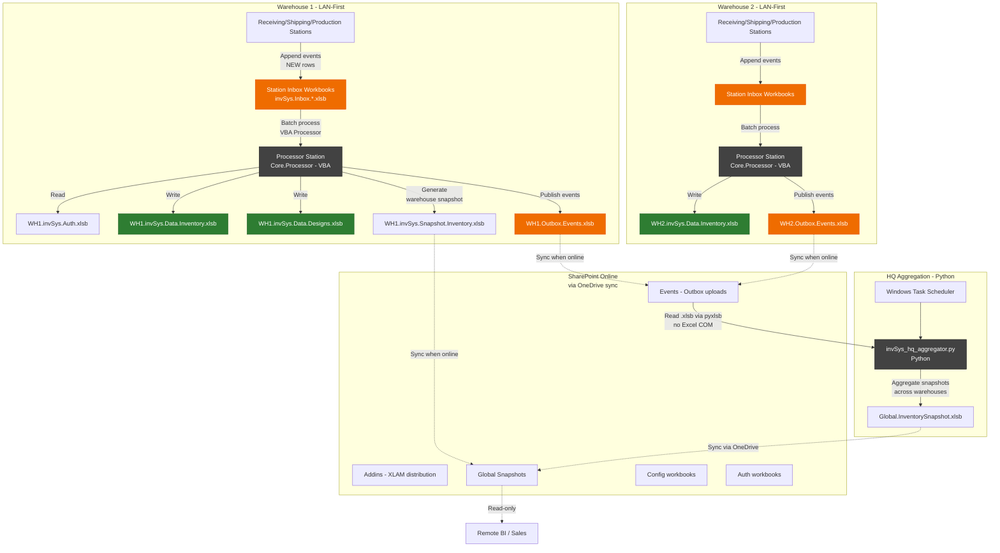
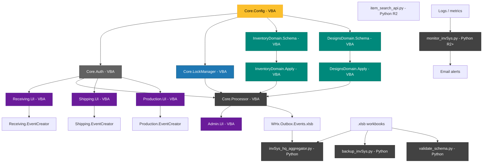
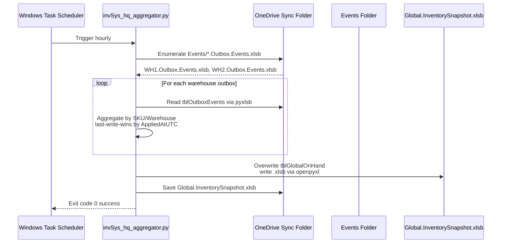
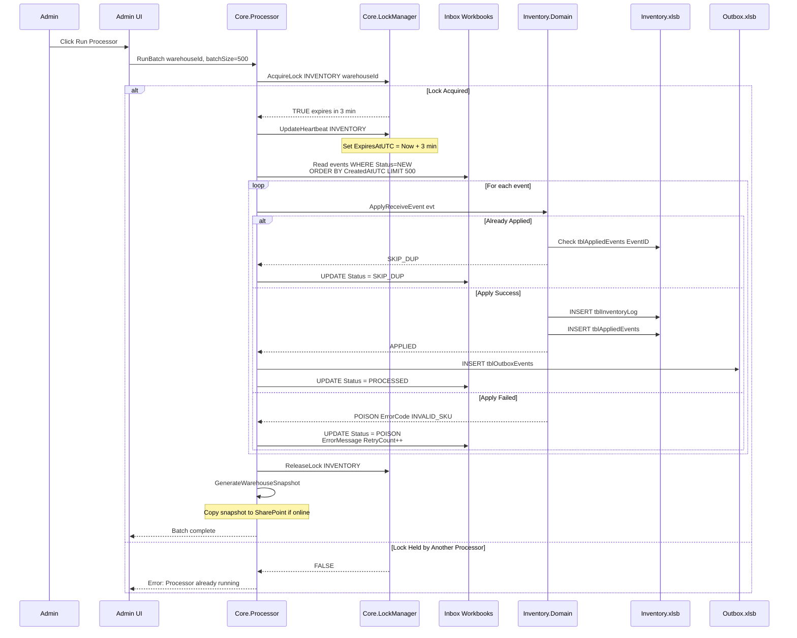

# Fixed Mermaid Diagrams for invSys v3.1

## System topology (Python HQ Aggregator)

---

## SharePoint folder structure

```mermaid
flowchart TB
  ROOT["SharePoint: /invSys"]

  ROOT --> ADDINS[Addins]
  ROOT --> EVENTS[Events]
  ROOT --> GLOBAL[Global]
  ROOT --> CONFIG[Config]
  ROOT --> AUTH[Auth]
  ROOT --> DOCS[Docs]
  ROOT --> ARCHIVE[Archive]

  ADDINS --> ADDINSCURRENT[Current]
  ADDINS --> ADDINSARCHIVE[Archive]

  ADDINSCURRENT --> XLAMCORE[invSys.Core.xlam]
  ADDINSCURRENT --> XLAMINV[invSys.Inventory.Domain.xlam]
  ADDINSCURRENT --> XLAMDES[invSys.Designs.Domain.xlam]
  ADDINSCURRENT --> XLAMRECV[invSys.Receiving.xlam]
  ADDINSCURRENT --> XLAMSHIP[invSys.Shipping.xlam]
  ADDINSCURRENT --> XLAMPROD[invSys.Production.xlam]
  ADDINSCURRENT --> XLAMADMIN[invSys.Admin.xlam]

  ADDINSARCHIVE --> V11[v1.1]
  ADDINSARCHIVE --> V12[v1.2]

  EVENTS --> EWH1[WH1.Outbox.Events.xlsb]
  EVENTS --> EWH2[WH2.Outbox.Events.xlsb]

  GLOBAL --> GINV[Global.InventorySnapshot.xlsb]
  GLOBAL --> GDES[Global.DesignsSnapshot.xlsb]

  CONFIG --> CWH1[WH1.invSys.Config.xlsb]
  CONFIG --> CWH2[WH2.invSys.Config.xlsb]

  AUTH --> AWH1[WH1.invSys.Auth.xlsb]
  AUTH --> AWH2[WH2.invSys.Auth.xlsb]

  style XLAMCORE fill:#1f78b4,stroke:#0b4f6c,color:#fff
  style XLAMINV fill:#00897b,stroke:#00695c,color:#fff
  style XLAMDES fill:#00897b,stroke:#00695c,color:#fff
  style XLAMRECV fill:#6a1b9a,stroke:#4a148c,color:#fff
  style XLAMSHIP fill:#6a1b9a,stroke:#4a148c,color:#fff
  style XLAMPROD fill:#6a1b9a,stroke:#4a148c,color:#fff
  style XLAMADMIN fill:#6a1b9a,stroke:#4a148c,color:#fff
  style EWH1 fill:#ef6c00,stroke:#e65100,color:#fff
  style EWH2 fill:#ef6c00,stroke:#e65100,color:#fff
  style GINV fill:#2e7d32,stroke:#1b5e20,color:#fff
  style GDES fill:#2e7d32,stroke:#1b5e20,color:#fff
  style CWH1 fill:#fbc02d,stroke:#f9a825,color:#000
  style CWH2 fill:#fbc02d,stroke:#f9a825,color:#000
  style AWH1 fill:#616161,stroke:#424242,color:#fff
  style AWH2 fill:#616161,stroke:#424242,color:#fff
```

---

## Repository layout

```mermaid
flowchart TB
  ROOT["invSys - repo root"]

  ROOT --> SRC[src]
  ROOT --> DATA[data]
  ROOT --> ASSETS[assets]
  ROOT --> DEPLOY[deploy]
  ROOT --> TOOLS[tools]
  ROOT --> DOCS[docs]
  ROOT --> TESTS[tests]

  SRC --> CORE[Core]
  SRC --> INVDOM[InventoryDomain]
  SRC --> DESDOM[DesignsDomain]
  SRC --> RECV[Receiving]
  SRC --> SHIP[Shipping]
  SRC --> PROD[Production]
  SRC --> ADMIN[Admin]

  CORE --> COREM[Modules]
  CORE --> COREC[ClassModules]
  CORE --> CORER[Ribbon]
  CORE --> CORECFG[Config]

  INVDOM --> INVDOMM[Modules]
  INVDOM --> INVDOMC[ClassModules]
  INVDOM --> INVDOMSCHEMA[Schema]

  RECV --> RECVM[Modules]
  RECV --> RECVF[Forms]
  RECV --> RECVR[Ribbon]

  DOCS --> DARCH[architecture]
  DOCS --> DWORK[workflows]
  DOCS --> DROLES[roles-permissions]
  DOCS --> DIMPL[implementation]

  TOOLS --> TPY["Python: hq_aggregator / backup / validation"]
  TOOLS --> TEXPORT[export-vba.ps1]
  TOOLS --> TBUILD[build-xlam.ps1]
  TOOLS --> TSYNC[sync-forms.ps1]
  TOOLS --> TCRYPTO[CryptoHelper.bas]

  TESTS --> TUNIT[unit]
  TESTS --> TINTEGRATION[integration]
  TESTS --> THARNESS[TestHarness.xlsm]

  style CORE fill:#1f78b4,stroke:#0b4f6c,color:#fff
  style INVDOM fill:#00897b,stroke:#00695c,color:#fff
  style DESDOM fill:#00897b,stroke:#00695c,color:#fff
  style RECV fill:#6a1b9a,stroke:#4a148c,color:#fff
  style SHIP fill:#6a1b9a,stroke:#4a148c,color:#fff
  style PROD fill:#6a1b9a,stroke:#4a148c,color:#fff
  style ADMIN fill:#6a1b9a,stroke:#4a148c,color:#fff
```

---

## Component dependency graph

---

## HQ global snapshot workflow

---

## Warehouse Processor Batch Application

