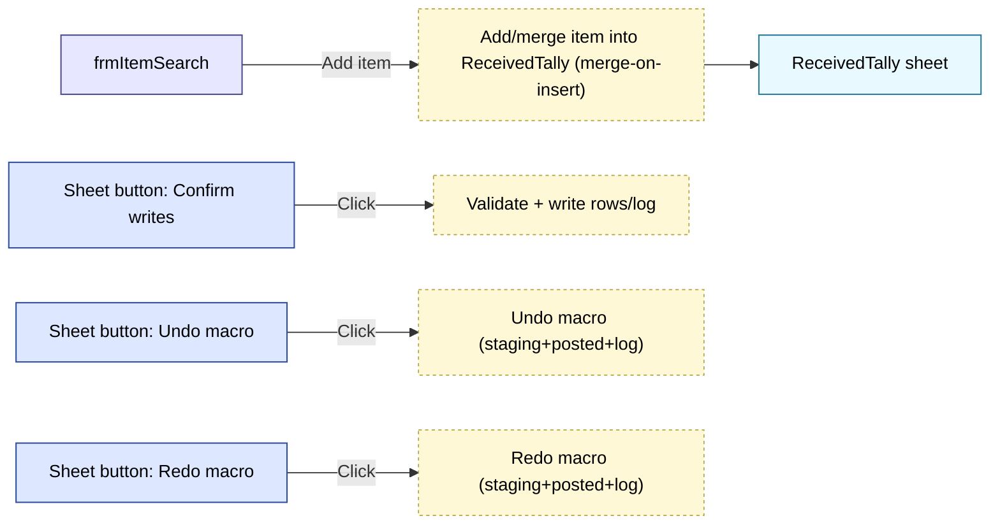

Forms Map / Controls Interaction — Mermaid
===========================================

```mermaid
flowchart LR
    classDef form fill:#e7e7ff,stroke:#4d4d8c,color:#000,stroke-width:1.2px;
    classDef sheet fill:#e8f9ff,stroke:#2c7a9b,color:#000,stroke-width:1.2px;
    classDef button fill:#dde7ff,stroke:#2f4e9c,color:#000,stroke-width:1.2px;
    classDef action fill:#fff8d7,stroke:#b5a542,color:#000,stroke-dasharray:3 3;

    FRM["frmItemSearch"]:::form
    SHEET["ReceivedTally sheet"]:::sheet
    BTN_CONFIRM["Sheet button: Confirm writes"]:::button
    BTN_UNDO["Sheet button: Undo macro"]:::button
    BTN_REDO["Sheet button: Redo macro"]:::button

    ACT_ADD["Add/merge item into ReceivedTally (merge-on-insert)"]:::action
    ACT_CONFIRM["Validate + write rows/log"]:::action
    ACT_UNDO["Undo macro (staging+posted+log)"]:::action
    ACT_REDO["Redo macro (staging+posted+log)"]:::action

    FRM -->|Add item| ACT_ADD --> SHEET
    BTN_CONFIRM -->|Click| ACT_CONFIRM
    BTN_UNDO -->|Click| ACT_UNDO
    BTN_REDO -->|Click| ACT_REDO
```
