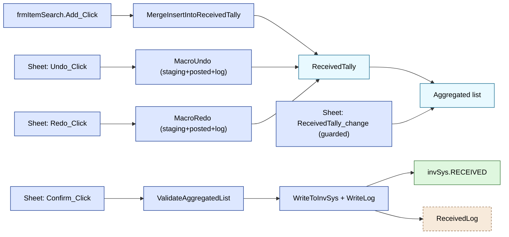

Event Entry Points — Mermaid
============================

```mermaid
flowchart LR
    classDef proc fill:#dde7ff,stroke:#2f4e9c,color:#000,stroke-width:1.2px;
    classDef list fill:#e8f9ff,stroke:#2c7a9b,color:#000,stroke-width:1.2px;
    classDef log fill:#f7eadb,stroke:#8c6239,color:#000,stroke-dasharray:4 3;
    classDef data fill:#dff7df,stroke:#2f6f2f,color:#000;

    E1["frmItemSearch.Add_Click"]:::proc
    E2["Sheet: ReceivedTally_change (guarded)"]:::proc
    E3["Sheet: Confirm_Click"]:::proc
    E4["Sheet: Undo_Click"]:::proc
    E5["Sheet: Redo_Click"]:::proc

    MERGE["MergeInsertIntoReceivedTally"]:::proc
    VALID["ValidateAggregatedList"]:::proc
    WRITE["WriteToInvSys + WriteLog"]:::proc
    UNDO["MacroUndo (staging+posted+log)"]:::proc
    REDO["MacroRedo (staging+posted+log)"]:::proc

    RT["ReceivedTally"]:::list
    AGG["Aggregated list"]:::list
    INV["invSys.RECEIVED"]:::data
    RLOG["ReceivedLog"]:::log

    E1 --> MERGE --> RT --> AGG
    E2 --> AGG
    E3 --> VALID --> WRITE
    WRITE --> INV
    WRITE --> RLOG
    E4 --> UNDO --> RT
    E5 --> REDO --> RT
```
