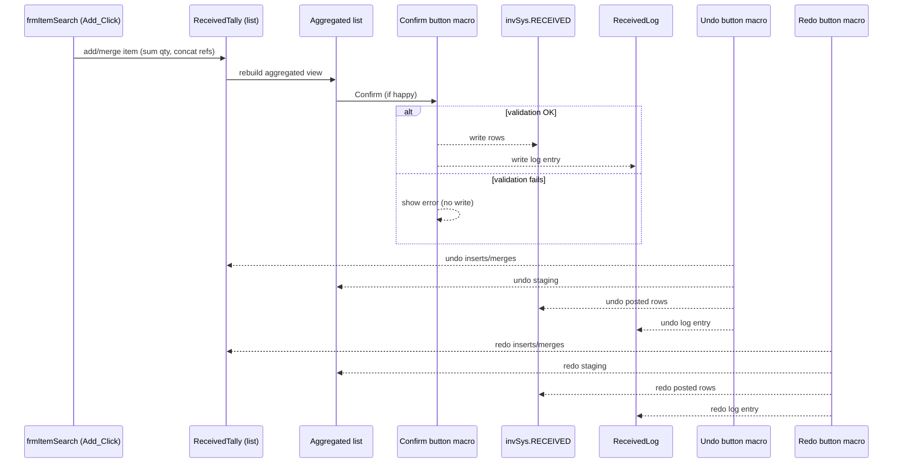

Event Entry Points — Mermaid (sequence view)
============================================

Buttons (Confirm / Undo / Redo) are generated in `modTS_Received`. This view shows who triggers what, without layout clutter.

