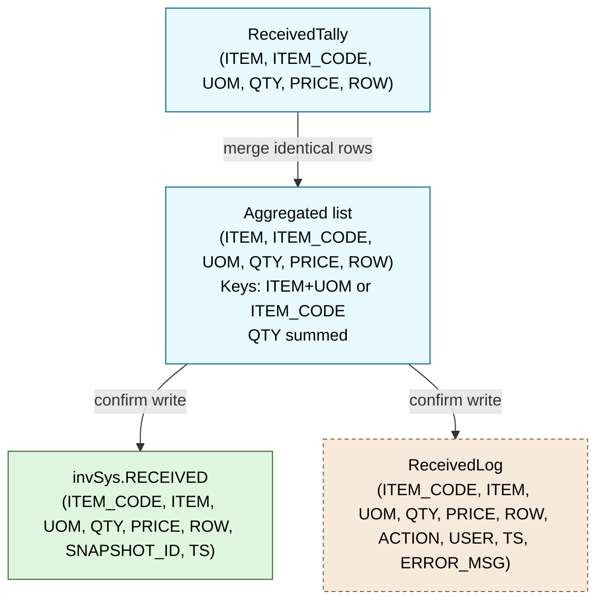

Data Contracts (tables/lists) — Mermaid
=======================================

```mermaid
flowchart TB
    classDef list fill:#e8f9ff,stroke:#2c7a9b,color:#000,stroke-width:1.2px;
    classDef data fill:#dff7df,stroke:#2f6f2f,color:#000;
    classDef log fill:#f7eadb,stroke:#8c6239,color:#000,stroke-dasharray:4 3;

    RT["ReceivedTally\n(ITEM, ITEM_CODE, UOM, QTY, PRICE, ROW)"]:::list
    AGG["Aggregated list\n(ITEM, ITEM_CODE, UOM, QTY, PRICE, ROW)\nKeys: ITEM+UOM or ITEM_CODE\nQTY summed"]:::list
    INV["invSys.RECEIVED\n(ITEM_CODE, ITEM, UOM, QTY, PRICE, ROW, SNAPSHOT_ID, TS)"]:::data
    RLOG["ReceivedLog\n(ITEM_CODE, ITEM, UOM, QTY, PRICE, ROW, ACTION, USER, TS, ERROR_MSG)"]:::log

    RT -->|merge identical rows| AGG
    AGG -->|confirm write| INV
    AGG -->|confirm write| RLOG
```
