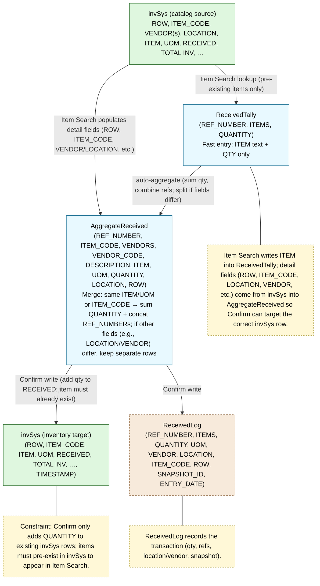
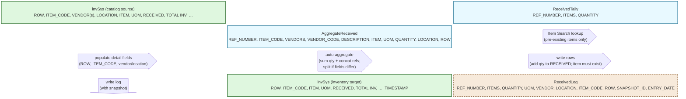

Data Contracts (tables/lists) — Mermaid
=======================================

Lookup, staging, and posting relationships for the Received Tally system. Prices/taxes are not tracked; logging captures qty/refs.

Flowchart
---------


Block diagram (distinctions: merge logic and flows)
---------------------------------------------------


Entity Relationship view
------------------------
```mermaid
erDiagram
    INV_SRC ||--o{ RECEIVEDTALLY : "lookup (items must pre-exist)"
    RECEIVEDTALLY ||--o{ AGGREGATE_RECEIVED : "aggregates (sum qty + concat refs; split if fields differ)"
    AGGREGATE_RECEIVED ||--|{ INV : writes (add qty to RECEIVED)
    AGGREGATE_RECEIVED ||--|{ RLOG : logs

    INV_SRC {
        string ROW
        string ITEM_CODE
        string ITEM
        string UOM
        string LOCATION
        decimal RECEIVED
        decimal TOTAL_INV
    }
    RECEIVEDTALLY {
        string REF_NUMBER
        string ITEMS
        decimal QUANTITY
    }
    AGGREGATE_RECEIVED {
        string REF_NUMBER
        string ITEM_CODE
        string VENDORS
        string VENDOR_CODE
        string DESCRIPTION
        string ITEM
        string UOM
        decimal QUANTITY
        string LOCATION
        string ROW
        string REF_NUMBERS
    }
    INV {
        string ROW
        string ITEM_CODE
        string ITEM
        string UOM
        decimal RECEIVED
        decimal TOTAL_INV
        string LOCATION
        datetime TIMESTAMP
    }
    RLOG {
        string REF_NUMBER
        string ITEMS
        decimal QUANTITY
        string UOM
        string VENDOR
        string LOCATION
        string ITEM_CODE
        string ROW
        string SNAPSHOT_ID
        datetime ENTRY_DATE
    }
```
