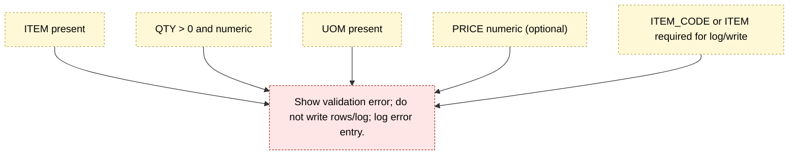

Validation & Error Rules — Mermaid
==================================

```mermaid
flowchart TB
    classDef rule fill:#fff8d7,stroke:#b5a542,color:#000,stroke-dasharray:3 3;
    classDef error fill:#ffe6e6,stroke:#b34747,color:#000,stroke-width:1.2px,stroke-dasharray:3 2;

    V1["ITEM present"]:::rule
    V2["QTY > 0 and numeric"]:::rule
    V3["UOM present"]:::rule
    V4["PRICE numeric (optional)"]:::rule
    V5["ITEM_CODE or ITEM required for log/write"]:::rule

    ERR["Show validation error; do not write rows/log; log error entry."]:::error

    V1 --> ERR
    V2 --> ERR
    V3 --> ERR
    V4 --> ERR
    V5 --> ERR
```
