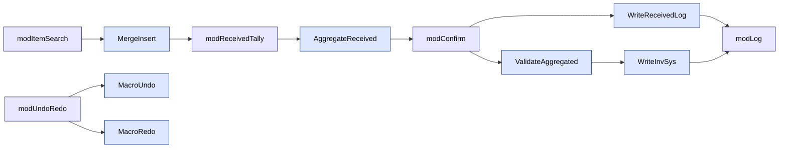

Module/Procedure Dependency — Mermaid
=====================================

```mermaid
flowchart LR
    classDef mod fill:#e7e7ff,stroke:#4d4d8c,color:#000,stroke-width:1.2px;
    classDef proc fill:#dde7ff,stroke:#2f4e9c,color:#000,stroke-width:1.1px;

    M1["modItemSearch"]:::mod
    M2["modReceivedTally"]:::mod
    M3["modConfirm"]:::mod
    M4["modUndoRedo"]:::mod
    M5["modLog"]:::mod

    P1["MergeInsert"]:::proc
    P2["AggregateReceived"]:::proc
    P3["ValidateAggregated"]:::proc
    P4["WriteInvSys"]:::proc
    P5["WriteReceivedLog"]:::proc
    P6["MacroUndo"]:::proc
    P7["MacroRedo"]:::proc

    M1 --> P1 --> M2
    M2 --> P2 --> M3
    M3 --> P3 --> P4
    M3 --> P5 --> M5
    M4 --> P6
    M4 --> P7

    P4 --> M5
```
