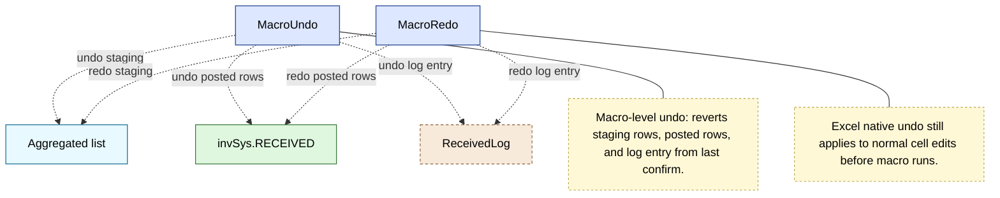

Undo / Redo Policy — Mermaid
============================

```mermaid
flowchart TB
    classDef list fill:#e8f9ff,stroke:#2c7a9b,color:#000,stroke-width:1.2px;
    classDef data fill:#dff7df,stroke:#2f6f2f,color:#000;
    classDef log fill:#f7eadb,stroke:#8c6239,color:#000,stroke-dasharray:4 3;
    classDef button fill:#dde7ff,stroke:#2f4e9c,color:#000,stroke-width:1.2px;
    classDef note fill:#fff8d7,stroke:#b5a542,color:#000,stroke-dasharray:3 3;

    AGG["Aggregated list"]:::list
    INV["invSys.RECEIVED"]:::data
    RLOG["ReceivedLog"]:::log

    UNDO["MacroUndo"]:::button
    REDO["MacroRedo"]:::button

    NOTE1["Macro-level undo: reverts staging rows, posted rows, and log entry from last confirm."]:::note
    NOTE2["Excel native undo still applies to normal cell edits before macro runs."]:::note

    UNDO -.->|undo staging| AGG
    UNDO -.->|undo posted rows| INV
    UNDO -.->|undo log entry| RLOG

    REDO -.->|redo staging| AGG
    REDO -.->|redo posted rows| INV
    REDO -.->|redo log entry| RLOG

    UNDO --- NOTE1
    REDO --- NOTE2
```
