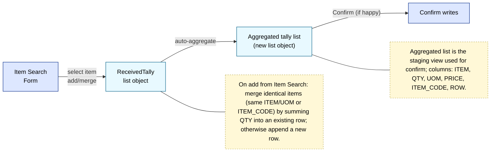
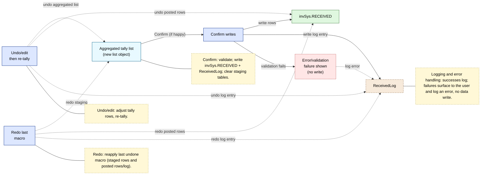

List-object-based received tally flow (no runtime form) — Mermaid views
======================================================================

This is split into two focused views: (A) staging with merge-on-insert and confirm trigger; (B) confirm/undo/redo with logging/error. The separate lookup step was removed—aggregation handles lookup/rollup.

View A — Received Tally system (staging + confirm trigger)
---------------------------------------------------------

View B — Confirm / Undo / Redo / Logging / Error
------------------------------------------------

