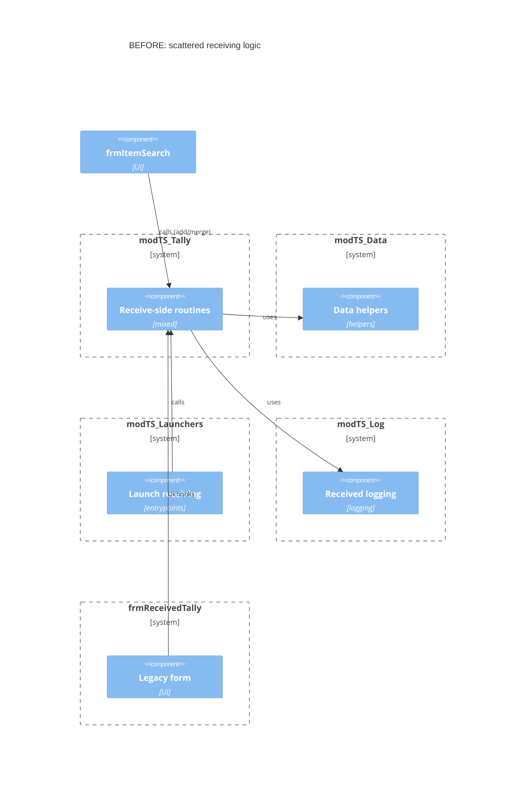
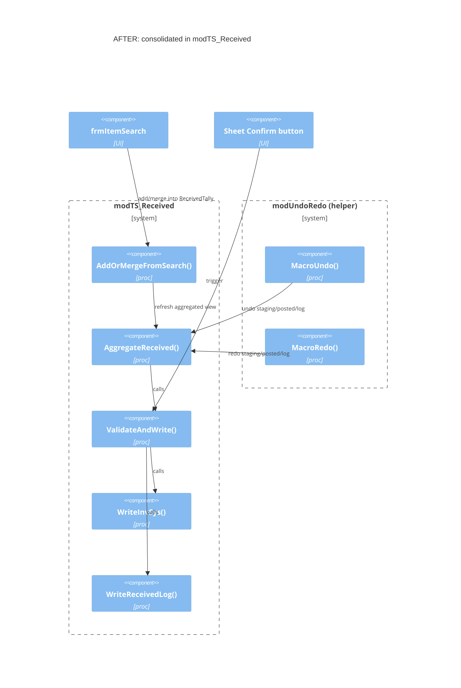
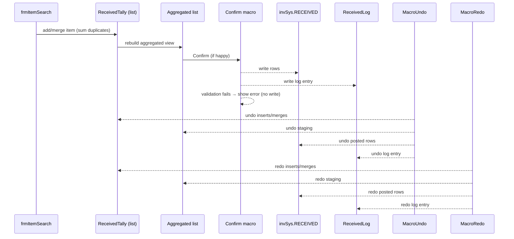
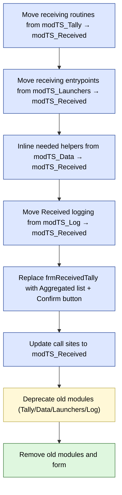

Refactor views — Received Tally system
======================================

This file gives three focused visuals: Before/After module layout (C4 style), the runtime sequence, and a small migration plan.

View 1 — Module consolidation (Before → After)
----------------------------------------------

View 2 — Runtime sequence (entry → confirm)
-------------------------------------------

View 3 — Migration plan (flowchart)
-----------------------------------

