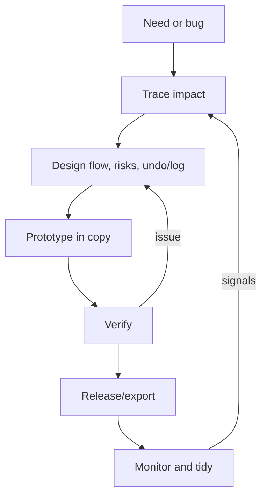

Better development approach for invSys
======================================

Guiding principles
- Protect the workbook: keep edits transactional (`modUR_Transaction` + snapshots) and reversible (undo/redo).
- Keep data first: any change must respect `invSys` table structure, dependent sheets (InventoryLog, tally sheets), and UserForms bindings.
- Prefer fast feedback: prototype on a copy, lean on small macros/tests to prove behavior before promoting to the main file.
- Document decisions: leave a trace in this plan doc and lightweight inline comments only when intent is non-obvious.

Working approach (tight loop)
1) Intake and trace impact
   - Capture the problem statement and success criteria.
   - Map impacted tables/columns, buttons/macros, and forms; note side-effects (logging, undo/redo, snapshots).
2) Shape and design
   - Draft the change in plain language + pseudo; define data flow and UI touchpoints.
   - Decide how it fits the transaction/undo model and logging requirements.
   - Identify risks (e.g., recalculation, screen updating, concurrent edits) and mitigation.
3) Build safely
   - Work in a copy of the workbook; export modules with `modExportImportAll` for version control.
   - Implement small, testable routines; keep globals minimal and reuse helpers (`GetItemUOMByRowNum`, `DisplayMessage`, logging utilities).
   - Wrap bulk edits in transactions; reset ScreenUpdating/Calculation/Events in `Cleanup` blocks.
4) Verify
   - Happy path: expected inventory math, log rows written, UI message updates.
   - Edge cases: blanks/invalid numbers, missing shapes/forms, undo/redo after bulk operations, rollback path.
   - Regression: cross-check that unrelated sheets and named ranges stay unchanged.
5) Release
   - Export updated modules; note the change, test notes, and rollback steps here.
   - Share the specific buttons/forms affected and any data prep needed for users.
6) Monitor and tidy
   - Watch InventoryLog and user feedback after release; address anomalies.
   - Remove dead code/flags only after confirming no dependencies in forms/sheets.

Mermaid view of the loop

Per-change checklist
- State the goal and acceptance criteria in this file.
- List impacted modules/forms/sheets and columns.
- Note test cases run (inputs, expected totals/log entries, undo/redo results).
- Capture rollback instructions (which modules to re-import, which snapshots/log rows to revert).
