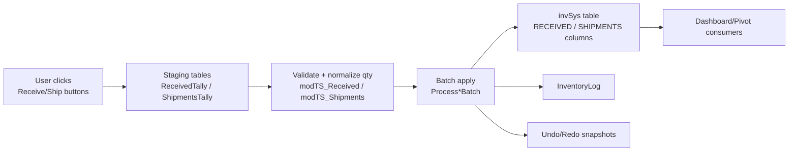

Rendering playground for invSys diagrams
========================================

Use this file to sanity-check that Mermaid and math renderers are working. For TikZ/PGF, build the companion TeX file noted below.

- Mermaid: open this file and run `Markdown Preview Enhanced: Open Preview` or `Mermaid: Preview Mermaid` in VS Code.
- Math: the LaTeX block below should render in the Markdown preview; toggle between built-in and KaTeX if needed.
- TikZ/PGF: open `plan docs/tikz_playground.tex` and run `LaTeX Workshop: Build LaTeX project` (MiKTeX should pick up the few packages used).
- Render-check loop (TikZ): after edits, build the PDF, then run `mgs -sDEVICE=pngalpha -r200 -sOutputFile="plan docs/<name>_%d.png" "plan docs/<name>.pdf"`; inspect the PNG for overlaps/clipping, adjust node distances/text widths/arrow bends, and delete the temporary PNGs. Repeat until clear.
- Layout guardrails (TikZ):
  - Give notes/text blocks explicit `text width` and `minimum width`; increase `node distance` instead of freehand spacing.
  - Anchor arrows to specific edges/corners and use gentle `out=/in=` angles or small `bend` to avoid long parallel runs along boxes.
  - Route feedback arrows with slight vertical offsets to keep them off adjacent nodes; avoid long parallel dashed lines beside actors.
  - Standardize colors/styles via `tikzset` so new nodes/arrows inherit spacing and bends.

Mermaid: tally flow sketch


LaTeX math: lightweight pseudocode
```latex
$$
\begin{aligned}
\text{normQty}(q, u)     &= \max(q, 0) \times \text{uomFactor}(u) \\
\text{applyRow}(r)       &= \text{clamp}\bigl(r_{\text{current}} + \text{normQty}(q, u)\bigr) \\
\text{tally}(t)          &= \sum_{r \in t} \text{applyRow}(r) \\
\text{logEntry}(r, \tau) &= \bigl(\text{GUID}, \tau, r.\text{item}, r.\text{qty}, \text{user}\bigr)
\end{aligned}
$$
```

PGF/TikZ: see `plan docs/tikz_playground.tex` for a simple, compilable diagram of the same flow.
